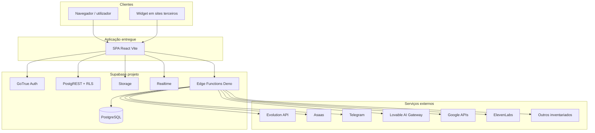

# Documentação operacional enterprise — hapitech-main

**Versão:** 1.0  
**Objetivo:** garantir **continuidade operacional** e **redução de conhecimento tribal** — qualquer profissional autorizado (desenvolvimento, DevOps, analista de operações) deve conseguir **operar**, **diagnosticar** e **recuperar** o sistema usando apenas este manual, os documentos referenciados e acesso aos painéis oficiais (Supabase, Cloudflare, Git, hosting, Evolution).

**Princípios:** uma única fonte da verdade para **procedimentos** (este ficheiro + runbooks); fonte da verdade para **estado desejado da aplicação** (Git); fonte da verdade para **configuração de runtime** (secrets nos sistemas apropriados — nunca só na cabeça de uma pessoa).

**Documentação de profundidade já existente no repositório (consultar em paralelo):**

| Documento | Conteúdo |
|-----------|-----------|
| `docs/PLANO_ENTERPRISE_RECONSTRUCAO_INFRA_TOTAL.md` | Plano de reconstrução infra, fases, cutover |
| `docs/ENGENHARIA_REVERSA_EDGE_FUNCTIONS_COMPLETA.md` | 31 Edge Functions, ENV, riscos |
| `docs/ENGENHARIA_REVERSA_WHATSAPP_EVOLUTION_COMPLETA.md` | WhatsApp / Evolution / wuzapi-proxy |
| `docs/ENGENHARIA_REVERSA_DOCKER_ORQUESTRACAO_COMPLETA.md` | Dockerfile, Compose exemplo |
| `docs/ENGENHARIA_REVERSA_DEVOPS_DEPLOY_CICD_COMPLETA.md` | CI GitHub Actions, gaps CD |
| `docs/ENGENHARIA_REVERSA_SUPABASE_COMPLETA.md` | Supabase geral |
| `docs/AUDITORIA_VARIAVEIS_SEGREDOS_COMPLETA.md` | Matriz ENV/secrets |
| `docs/AUDITORIA_SEGURANCA_COMPLETA.md` | Achados segurança |
| `docs/INVENTARIO_SERVICOS_EXTERNOS_COMPLETO.md` | APIs externas, webhooks |
| `docs/INVENTARIO_TECNOLOGIAS_COMPLETO.md` | Stack tecnológica |
| `docs/RECONSTRUCAO_INFRAESTRUTURA_COMPLETA.md` | Visão reconstrução |

**Artefactos de infra exemplo:** `infra/docker-compose.stack.example.yml`, `infra/caddy/Caddyfile.example`, `infra/ci/github-actions-cd.example.yml`.

---

## Índice rápido (formato de saída pedido)

1. [Resumo executivo](#1-resumo-executivo)  
2. [Arquitetura sistema](#2-arquitetura-sistema)  
3. [Arquitetura infraestrutura](#3-arquitetura-infraestrutura)  
4. [Arquitetura DevOps](#4-arquitetura-devops)  
5. [Documentação deploy](#5-documentação-deploy)  
6. [Documentação Supabase](#6-documentação-supabase)  
7. [Documentação Evolution API](#7-documentação-evolution-api)  
8. [Documentação segurança](#8-documentação-segurança)  
9. [Runbooks operacionais](#9-runbooks-operacionais)  
10. [Runbooks incidentes](#10-runbooks-incidentes)  
11. [Runbooks recovery](#11-runbooks-recovery)  
12. [Plano observabilidade](#12-plano-observabilidade)  
13. [Plano governança](#13-plano-governança)  
14. [Checklist operação diária](#14-checklist-operação-diária)  
15. [Checklist segurança](#15-checklist-segurança)  
16. [Checklist produção](#16-checklist-produção)  
17. [Checklist disaster recovery](#17-checklist-disaster-recovery)  
18. [Checklist onboarding](#18-checklist-onboarding)  

**Anexos:** [Variáveis, secrets e integrações](#anexo-a-variáveis-secrets-integrações-e-webhooks) · [Procedimentos 1–12 (subir ambientes e validar)](#anexo-b-procedimentos-operacionais-1–12) · [Lista Edge Functions](#anexo-c-lista-edge-functions-supabase)

---

## 1. Resumo executivo

O produto **hapitech-main** é uma **SPA** (React + Vite + TypeScript) que comunica com **Supabase** (PostgreSQL com RLS, Auth, Storage, Realtime) e com **31 Edge Functions** Deno sob `/functions/v1/*`. Canais incluem **WhatsApp** (Evolution API via `wuzapi-proxy` e webhook `whatsapp-webhook`), **Telegram**, **widget**, **Google Calendar**, **billing Asaas**, **IA** (gateway Lovable e outros provedores), entre outros.

**Operação diária** envolve: disponibilidade da SPA e CDN; quotas e erros no Supabase; webhooks externos (Asaas, Evolution, Telegram); segredos e rotações; backups de dados pessoais (LGPD); resposta a incidentes segundo runbooks.

**Papel deste manual:** padronizar linguagem e passos; **não** substitui contratos com fornecedores (Supabase, Cloudflare, VPS) — mantém links e responsabilidades claras.

---

## 2. Arquitetura sistema

### 2.1 Visão lógica

### 2.2 Arquitetura frontend

| Aspeto | Detalhe | Evidência |
|--------|---------|-----------|
| Stack | React 18, Vite 5, TypeScript, TanStack Query, React Router, shadcn/Radix, Tailwind | `package.json`, `vite.config.ts` |
| Entrada | `src/main.tsx` → `App.tsx` | Rotas em `src/App.tsx` |
| Cliente API | `createClient` com `VITE_SUPABASE_URL` e `VITE_SUPABASE_PUBLISHABLE_KEY` | `src/integrations/supabase/client.ts` L5–20 |
| Build | `npm run build` → `dist/` | `package.json` L8 |
| Dev | `npm run dev` — Vite porta **8080** (`host: "::"`) | `vite.config.ts` L8–10 |
| Produção estática | `npm run start` — `serve dist -s -l 3000` | `package.json` L10 |

### 2.3 Arquitetura “backend”

Não existe servidor HTTP Node da aplicação no repositório. O **backend** é:

1. **Supabase** (API + BD + Auth + Storage + Realtime).  
2. **Edge Functions** (lógica Deno, frequentemente com `SUPABASE_SERVICE_ROLE_KEY` para operações privilegiadas).

### 2.4 Arquitetura Supabase

Ver `docs/ENGENHARIA_REVERSA_SUPABASE_COMPLETA.md` e secção [6](#6-documentação-supabase) abaixo.

### 2.5 Arquitetura WhatsApp

Proxy autenticado `wuzapi-proxy` → Evolution REST; inbound `whatsapp-webhook`. Detalhe: `docs/ENGENHARIA_REVERSA_WHATSAPP_EVOLUTION_COMPLETA.md`.

### 2.6 Arquitetura Docker

`Dockerfile` multi-stage (build + `serve`). Compose exemplo em `infra/`. Ver `docs/ENGENHARIA_REVERSA_DOCKER_ORQUESTRACAO_COMPLETA.md`.

### 2.7 Arquitetura DevOps

CI em `.github/workflows/ci.yml`; CD/deploy **não** totalmente automatizado no repo — ver `docs/ENGENHARIA_REVERSA_DEVOPS_DEPLOY_CICD_COMPLETA.md` e secção [4](#4-arquitetura-devops).

---

## 3. Arquitetura infraestrutura

### 3.1 Componentes típicos de produção (referência enterprise)

| Camada | Função operacional |
|--------|-------------------|
| **DNS / WAF / CDN** | Cloudflare (ou equivalente): registos, TLS, proteção, cache estático |
| **VPS Linux** | Hospedagem Docker/Coolify ou equivalente; hardening; firewall |
| **Docker + Compose** | Ciclo de vida de containers; volumes persistentes |
| **Coolify** (se usado) | Git → build → run; variáveis por serviço; webhooks deploy |
| **Reverse proxy + SSL** | Terminação TLS; encaminhamento para container SPA; headers segurança |
| **Volumes** | Dados Evolution; certificados ACME; estado interno painéis |
| **Persistência negócio** | Supabase (PG + Storage); **não** substituível apenas por volumes locais |

### 3.2 Responsabilidades por equipa

| Equipa | Responsabilidade primária |
|--------|---------------------------|
| DevOps / SRE | VPS, Docker, proxy, TLS, DNS, CI/CD, backups infra, alertas |
| Desenvolvimento | Código, migrações, testes, revisão segurança em PR |
| Operações / Suporte | Utilizadores, filas de incidente, validação funcional pós-deploy |
| Segurança / Compliance | Rotação segredos, auditoria, LGPD, revisão WAF |
| Dados | Políticas backup/restore PG, anonimização staging |

---

## 4. Arquitetura DevOps

| Elemento | Estado no repositório | Ação operacional recomendada |
|----------|------------------------|------------------------------|
| Repositório Git | Código-fonte + `docs/` | Branch protection; PR obrigatório; CODEOWNERS |
| CI | `.github/workflows/ci.yml` | Garantir `VITE_*` em CI para build fiável; remover `continue-on-error` em testes em `main` quando política permitir |
| CD | Exemplo `infra/ci/github-actions-cd.example.yml` | Promover para pipeline real com secrets por environment |
| Artefactos | Upload `dist/` 7 dias no CI | Estender retenção ou publicar em registry conforme política |
| Supabase deploy | CLI / Dashboard | Documentar comando exato na runbook RB-EDGE |

---

## 5. Documentação deploy

### 5.1 Deploy frontend

**Pré-requisitos:** Node 22; `npm ci`; variáveis `VITE_SUPABASE_URL` e `VITE_SUPABASE_PUBLISHABLE_KEY` definidas no ambiente de build (`src/integrations/supabase/client.ts`).

**Passos genéricos:**

1. `git pull` na revisão aprovada.  
2. Exportar ou injetar `VITE_*` (nunca commitar valores reais no Git).  
3. `npm ci` → `npm run build`.  
4. Publicar conteúdo de `dist/` (Coolify build, Docker image, ou CDN).  
5. Invalidar cache CDN se aplicável.  
6. Smoke: abrir URL pública, login, abrir Chat e Integrações.

**Docker:** `docker build` a partir da raiz com `Dockerfile`; se usar build-args, o `Dockerfile` deve declarar `ARG`/`ENV` antes de `npm run build` (ver doc Docker).

### 5.2 Deploy Edge Functions

1. Instalar Supabase CLI autenticado (`supabase login`).  
2. `supabase link --project-ref <REF>`.  
3. `supabase secrets set KEY=value ...` (lista completa em `docs/AUDITORIA_VARIAVEIS_SEGREDOS_COMPLETA.md` e `docs/ENGENHARIA_REVERSA_EDGE_FUNCTIONS_COMPLETA.md`).  
4. `supabase functions deploy <nome>` ou script que faça deploy de todas as pastas em `supabase/functions/`.  
5. Validar logs no Dashboard Supabase → Edge Functions.

### 5.3 Deploy Evolution API

Fora do código da app — operador segue imagem oficial ou compose interno; após deploy, **reconfigurar webhooks** para o `SUPABASE_URL` correto (via UI ou `wuzapi-proxy` action `set-webhook`).

### 5.4 Staging vs produção

| Ambiente | URL | Supabase | Segredos |
|----------|-----|----------|----------|
| Staging | Domínio/subdomínio dedicado | Projeto Supabase **staging** recomendado | Secrets staging no CI/hosting |
| Produção | Domínio produção | Projeto produção | Secrets produção; MFA em consolas |

### 5.5 Rollback

Ver **RB-ROLLBACK-DEPLOY** e **RB-RESTORE-BACKUP** nas secções de runbooks.

### 5.6 CI/CD

Ver secção 4 e `docs/ENGENHARIA_REVERSA_DEVOPS_DEPLOY_CICD_COMPLETA.md`.

---

## 6. Documentação Supabase

### 6.1 Banco de dados

- **Schema:** migrações versionadas em `supabase/migrations/*.sql`.  
- **Operação:** aplicar sempre via pipeline revisado ou `supabase db push` após review de migração.  
- **Backup:** usar backups automáticos do plano + export `pg_dump` periódico para armazenamento imutável (política interna).

### 6.2 Migrations

- Nunca editar migrações já aplicadas em produção — criar nova migração corretiva.  
- Manter ordem temporal dos ficheiros.

### 6.3 Auth

- Fluxos: login, convite (`invite-org-member`, `accept-invite`), recuperação (`send-recovery-email`, `verify-recovery-code`), OAuth Google (calendar/gmail).  
- Redirect URLs devem coincidir com domínios reais da app (Auth → URL configuration).

### 6.4 RLS e policies

- RLS ativo em tabelas sensíveis; políticas em SQL nas migrações.  
- **Operação:** após alteração de política, executar testes de regressão de acesso (utilizador A não lê dados B).

### 6.5 Storage

- Buckets referenciados no código (ex.: `knowledge`, `chat-media` — confirmar em migrações e `src/lib/media.ts`).  
- CORS e políticas de bucket devem refletir apenas origens da SPA de produção/staging.

### 6.6 Edge Functions

Lista nominal no [Anexo C](#anexo-c-lista-edge-functions-supabase). Config JWT: `supabase/config.toml` — **cada** função listada com `verify_jwt = false` implica validação manual no código; funções **não** listadas devem ser confirmadas no Dashboard.

### 6.7 Webhooks (inbound para Supabase)

- **Asaas** → `asaas-webhook`.  
- **Evolution** → `whatsapp-webhook`.  
- **Telegram** → `telegram-webhook` (com `connId`).  

Após mudança de `SUPABASE_URL`, atualizar **todos** os painéis externos.

---

## 7. Documentação Evolution API

### 7.1 Sessões

Estado criptográfico WhatsApp mantido no **servidor Evolution** (volumes); a aplicação guarda apenas metadados em `wuzapi_connections` (`phone_number` = nome instância, `is_connected`, etc.).

### 7.2 QR Code

Fluxo UI: `src/hooks/useEvolutionApi.ts` + `Integrations.tsx`; backend: `wuzapi-proxy` actions `save-config`, `create-instance`, `connect`.

### 7.3 Webhooks

Evolution POST para `https://<project>.supabase.co/functions/v1/whatsapp-webhook` — configurado por `wuzapi-proxy` após create/connect/status (formatos v1/v2 Evolution).

### 7.4 Containers e persistência

Definidos pelo operador Evolution; não versionados no app repo — ver `docs/ENGENHARIA_REVERSA_WHATSAPP_EVOLUTION_COMPLETA.md`.

### 7.5 Reconexão

`useWhatsAppConnectionMonitor`, `AppLayout`, ações `connect` / `restart` / `logout` no proxy.

---

## 8. Documentação segurança

### 8.1 Gestão de acessos

- Git: equipas mínimas; MFA obrigatório.  
- Supabase: roles Owner/Developer com MFA; não partilhar `service_role` em canais.  
- Cloudflare / VPS: RBAC; contas individuais (não “utilizador empresa”).

### 8.2 SSH keys

Ed25519; uma chave por pessoa; rotação documentada; desativar login por password na VPS.

### 8.3 MFA

Obrigatório em Git, Supabase, Cloudflare, Coolify admin, e-mail corporativo.

### 8.4 Rotação de segredos e tokens

Inventário em `docs/AUDITORIA_VARIAVEIS_SEGREDOS_COMPLETA.md`. Procedimento: gerar novo secret → atualizar Supabase secrets / CI / Evolution → validar → revogar antigo → registo em log de auditoria.

### 8.5 Backups

Ver secção 11 (recovery) e plano backup em `docs/PLANO_ENTERPRISE_RECONSTRUCAO_INFRA_TOTAL.md`.

### 8.6 Auditoria

Logs de deploy; Git audit log; Supabase logs; export periódico de políticas WAF/DNS.

### 8.7 LGPD

Dados de contactos e mensagens em PG; conteúdo em Storage; bases legais e retenção definidas pela empresa; direitos dos titulares (acesso/apagamento) com processo interno — **consultar jurídico**; operação técnica: apagar utilizador em Auth + anonimizar/purge conforme política.

---

## 9. Runbooks operacionais

*Convencção:* **RB-XXX** = runbook. Cada um assume acesso aos painéis documentados e permissões adequadas.

### RB-DEPLOY-FAIL — Deploy falhou

1. Identificar **camada**: build (CI), registry, hosting, ou CDN.  
2. Recolher logs: GitHub Actions job; Coolify deploy log; `docker logs` se aplicável.  
3. Se falha de build: verificar erros `npm run build` — frequentemente `VITE_*` ausente ou TypeScript.  
4. Se falha runtime “Missing Supabase environment variables”: rebuild com `VITE_SUPABASE_URL` e `VITE_SUPABASE_PUBLISHABLE_KEY`.  
5. Se falha 502 no proxy: verificar upstream container a correr e healthcheck.  
6. Comunicar estado no canal de incidente; se não houver rollback imediato, reverter DNS para versão estável **apenas** se política o permitir.

### RB-VPS-DOWN — VPS caiu

1. Confirmar com ping/traceroute e painel do provedor (hypervisor status).  
2. Se reboot não voluntário: após subir, `docker ps -a`, verificar volumes montados.  
3. Verificar serviços systemd (docker, fail2ban, sshd).  
4. Validar TLS e aplicação conforme RB-HEALTH.

### RB-DOCKER-DOWN — Docker daemon parou

1. `sudo systemctl status docker`.  
2. `journalctl -u docker -n 200 --no-pager`.  
3. Reiniciar `sudo systemctl restart docker` se política o permitir.  
4. `docker compose up -d` no diretório do stack.  
5. Validar containers e redes.

### RB-SSL-EXPIRED — SSL expirou

1. Identificar emissor (Cloudflare universal cert vs Let's Encrypt no origin).  
2. Se origin: verificar renovação ACME (Caddy/Traefik logs), espaço em disco em volume cert.  
3. Forçar renovação conforme ferramenta; validar com `curl -vI https://host`.  
4. Se Cloudflare Full strict: certificado origin também tem de ser válido.

### RB-DNS-FAIL — DNS falhou

1. Verificar `dig NS` e `dig A` do domínio.  
2. Painel Cloudflare: registos, proxy status, CAA.  
3. TTL e propagação; corrigir registos errados.  
4. Validar a partir de múltiplas redes/resolvers.

### RB-WA-DISCONNECT — WhatsApp desconectou

1. Dashboard app: toast / banner “WhatsApp caiu” (`useWhatsAppConnectionMonitor`).  
2. Supabase: `wuzapi_connections.is_connected` e `connection_events`.  
3. Evolution: estado instância; logs Evolution.  
4. Ação: utilizador **Canais** → reconectar / novo QR (`useEvolutionApi` → `connect`).  
5. Se massivo: verificar `EVO_URL`/`EVO_KEY` nos secrets Edge e saúde do servidor Evolution.

### RB-QR-EXPIRED — QR Code expirou

1. Gerar novo QR via UI (ação `connect`).  
2. Se falha repetida: `restart` instância; verificar relógio servidor e rede.

### RB-WEBHOOK-FAIL — Webhook falhou (genérico)

1. Identificar fornecedor (Asaas / Evolution / Telegram).  
2. Logs Edge Function correspondente no Supabase.  
3. Confirmar URL configurada no fornecedor = URL atual do projeto.  
4. Confirmar HTTPS válido e corpo esperado; para Asaas verificar assinatura se implementada.  
5. Reenviar evento de teste do fornecedor.

### RB-EDGE-FAIL — Edge Function falhou

1. Dashboard → Logs da função; filtrar por status 5xx.  
2. Verificar secrets `Deno.env.get` em falta (`LOVABLE_API_KEY`, etc.).  
3. Re-deploy função: `supabase functions deploy <nome>`.  
4. Se regressão: deploy versão anterior do `index.ts` (Git revert + deploy).

### RB-SUPABASE-FAIL — Supabase indisponível ou erro global

1. Status page Supabase.  
2. Verificar quotas e billing.  
3. Verificar incidentes região.  
4. Comunicar utilizadores se downtime prolongado; ativar mensagem de manutenção na SPA se existir feature.

### RB-ROLLBACK-DEPLOY — Rollback de deploy frontend

1. Identificar digest/tag imagem anterior estável no registry ou commit Git da build anterior.  
2. No Coolify/hosting: redeploy tag anterior.  
3. Invalidar CDN.  
4. Smoke login + Chat.  
5. Registar causa raiz em postmortem.

---

## 10. Runbooks incidentes

### RB-INC-SEC — Incidente de segurança (genérico)

1. **Isolar:** revogar chaves comprometidas imediatamente (Supabase rotate, Evolution `EVO_KEY`, Git tokens).  
2. **Preservar evidência:** export logs antes de perder retenção.  
3. **Notificar:** DPO/jurídico se dados pessoais; clientes se contrato exigir.  
4. **Corrigir:** patches; remover vetor (ex.: webhook público sem validação).  
5. **Repor:** novos secrets; validação completa.  
6. **Postmortem:** 72h após encerramento.

### RB-LEAK-TOKEN — Vazamento de token

1. Assumir comprometido **se** token esteve em repo público, log, ou ticket.  
2. Rotacionar: `SUPABASE_SERVICE_ROLE_KEY` (Supabase dashboard — impacta **todas** as Edge que o usam); `EVO_KEY`; tokens Asaas/Google conforme caso.  
3. Atualizar secrets em Supabase + CI + Evolution.  
4. Re-deploy Edge Functions.  
5. Auditar acessos anómalos em Auth e PG.

### RB-PASSWORD-RESET-OPS — Troca senha operacional (conta painel)

Procedimento interno por ferramenta (Supabase, Cloudflare, Git): MFA → Password → sessões activas revogadas.

### RB-ROTATE-SECRETS — Rotação programada de secrets

1. Inventário (`docs/AUDITORIA_VARIAVEIS_SEGREDOS_COMPLETA.md`).  
2. Janela de manutenção.  
3. Atualizar Supabase secrets na ordem: dependências externas primeiro, depois funções que consomem.  
4. `supabase functions deploy` em lote ou função a função com smoke.  
5. Documentar data e responsável.

---

## 11. Runbooks recovery

### RB-RESTORE-BACKUP — Restauro geral (orientação)

1. **Parar escritas** que conflitem (modo manutenção na SPA se possível).  
2. **Restaurar PG** conforme método Supabase (PITR ou restore backup) — seguir documentação oficial do plano.  
3. **Restaurar Storage** a partir de backup de objetos se existir.  
4. **Evolution:** restaurar volume de instâncias a partir de snapshot; reiniciar serviço.  
5. **Validar:** integridade referencial, contagens de linhas, login, mensagem teste WA.  
6. **Retomar** tráfego.

### RB-RESTORE-DB — Restauro base de dados (detalhe)

Coordenar com DBA ou responsável dados; testar restore primeiro em **projeto cópia** se disponível.

### RB-RESTORE-CONTAINERS — Restauro apenas containers

`docker compose pull` + `up` com tag fixa; volumes a partir de snapshot do host.

### RB-RESTORE-WA-SESSION — Sessões WhatsApp

Restore do volume Evolution + mesmos `instanceName`; se impossível, novo QR e reconfiguração webhooks.

### RB-RESTORE-DEPLOY — Restauro de deploy

Equivalente a RB-ROLLBACK-DEPLOY + validação estendida.

---

## 12. Plano observabilidade

| Sinal | Ferramenta sugerida | Ação |
|-------|---------------------|------|
| SPA down | Uptime externo multi-região | Pager se > N minutos |
| 5xx Edge | Supabase logs + métricas | Investigar função |
| PG CPU | Supabase dashboard | Query tuning / plano |
| Disco VPS | node_exporter / `df -h` | Limpar logs / expandir disco |
| Erros JS | Sentry | Triagem sprint |

**Logs:** agregar logs de proxy e Docker; retenção conforme política; **não** logar PII em claro em pipelines adicionais.

---

## 13. Plano governança

| Área | Regra |
|------|-------|
| **Mudanças** | PR + 1 aprovação mínima; mudanças prod em janela |
| **Emergências** | Bypass documentado com aprovação verbal + registo pós-facto em 24h |
| **Acessos** | Revisão trimestral de membros Git/Supabase/Cloudflare |
| **Documentação** | Este ficheiro atualizado em cada grande mudança de arquitectura |
| **LGPD** | Encarregado dados nomeado na empresa; fluxo de pedidos titulares |

---

## 14. Checklist operação diária

- [ ] Verificar dashboard uptime (tudo verde)  
- [ ] Verificar erros 5xx Supabase (últimas 24h)  
- [ ] Verificar fila de incidentes / tickets críticos  
- [ ] Verificar backups automáticos Supabase (estado “ok”)  
- [ ] Verificar espaço em disco VPS (se self-host)  
- [ ] Verificar conexões WA ativas (amostragem)

---

## 15. Checklist segurança

- [ ] MFA ativo em todas as contas admin  
- [ ] Nenhum secret em texto claro no Git  
- [ ] Rotação de chaves conforme calendário  
- [ ] WAF Cloudflare com regras mínimas activas  
- [ ] Revisão de PR com checklist segurança (RLS, novos endpoints)

---

## 16. Checklist produção

- [ ] Build de produção com `VITE_*` correctos  
- [ ] Edge deployadas com secrets completos  
- [ ] Webhooks externos apontando para URLs finais HTTPS  
- [ ] SSL válido > 14 dias para expiração  
- [ ] Smoke pós-deploy executado e assinado  
- [ ] Plano rollback comunicado à equipa

---

## 17. Checklist disaster recovery

- [ ] Último teste de restore documentado (< 6 meses)  
- [ ] Cópia de contactos de emergência fornecedores actualizada  
- [ ] Runbook DR impresso ou offline acessível  
- [ ] Credenciais de break-glass em cofre físico/digital aprovado

---

## 18. Checklist onboarding

### Novo desenvolvedor

- [ ] Acesso Git (equipa) + MFA  
- [ ] Acesso Supabase (dev/staging) read-only primeiro  
- [ ] Clonar repo; `npm ci`; criar `.env` local com `VITE_*` de **dev**  
- [ ] `npm run dev` — confirmar http://localhost:8080  
- [ ] Ler `docs/DOCUMENTACAO_OPERACIONAL_ENTERPRISE_COMPLETA.md` + `docs/ENGENHARIA_REVERSA_EDGE_FUNCTIONS_COMPLETA.md`  
- [ ] Ler política de branches e testes

### Novo DevOps

- [ ] Acessos Cloudflare, VPS, Coolify, Supabase owner/devops  
- [ ] Ler `docs/PLANO_ENTERPRISE_RECONSTRUCAO_INFRA_TOTAL.md` + Docker/DevOps docs  
- [ ] Executar RB-HEALTH em staging  
- [ ] Shadowing de um deploy real

### Novo analista de operações

- [ ] Acesso a tickets e dashboards read-only Supabase  
- [ ] Treino em RB-WA-DISCONNECT, RB-WEBHOOK-FAIL, RB-EDGE-FAIL  
- [ ] Contacto escalação nível 2

---

# Anexo A — Variáveis, secrets, integrações e webhooks

### A.1 Frontend (`VITE_*`)

| Variável | Obrigatória | Uso |
|----------|-------------|-----|
| `VITE_SUPABASE_URL` | Sim | URL API Supabase |
| `VITE_SUPABASE_PUBLISHABLE_KEY` | Sim | Chave anon/publicável |
| `VITE_SUPABASE_PROJECT_ID` | Opcional | Referências UI/Integrações |
| `VITE_GOOGLE_CLIENT_ID` | Opcional | OAuth Google no front se usado |

**Evidência obrigatoriedade:** `src/integrations/supabase/client.ts` L5–9.

### A.2 Edge Functions (lista de nomes `Deno.env` — ver auditoria)

Referência completa: `docs/AUDITORIA_VARIAVEIS_SEGREDOS_COMPLETA.md` e `docs/ENGENHARIA_REVERSA_EDGE_FUNCTIONS_COMPLETA.md`. Incluem entre outros: `SUPABASE_URL`, `SUPABASE_SERVICE_ROLE_KEY`, `SUPABASE_ANON_KEY`, `LOVABLE_API_KEY`, `ASAAS_API_KEY`, `EVO_URL`, `EVO_KEY`, `GOOGLE_CLIENT_ID`, `GOOGLE_CLIENT_SECRET`, `ELEVENLABS_*`, `SITE_URL`, `RECOVERY_WEBHOOK_URL`, etc.

### A.3 Integrações e serviços terceiros

Inventário: `docs/INVENTARIO_SERVICOS_EXTERNOS_COMPLETO.md` — inclui Evolution, Lovable, OpenAI, Google, Telegram, Asaas, ElevenLabs, Clinicorp, Solar Market, Jina, YouTube, etc.

### A.4 Webhooks inbound (para a plataforma)

| Origem | Destino |
|--------|---------|
| Asaas | `asaas-webhook` |
| Evolution (WhatsApp) | `whatsapp-webhook` |
| Telegram | `telegram-webhook?connId=...` |

### A.5 Webhooks outbound (da plataforma)

Regras `webhook_rules` em agentes — HTTP POST para URLs configuradas pelo cliente (`whatsapp-webhook`, `check-inactivity`, etc.) — risco SSRF; validar URLs na política de produto.

### A.6 OAuth

Google: `google-oauth-token`, `google-calendar`, `gmail-oauth-token`; fluxos no front `useGoogleCalendar`, `SmtpSettingsTab`, etc.

### A.7 Dependências críticas

Supabase disponível; `VITE_*` correctas; secrets Edge completos; Evolution se WA activo; Lovable/OpenAI conforme funcionalidades IA activas.

### A.8 Riscos operacionais (resumo)

- CI sem `VITE_*` pode mascarar problemas (`docs/AUDITORIA_VARIAVEIS_SEGREDOS_COMPLETA.md`).  
- `verify_jwt=false` em muitas functions — superfície ampla (`supabase/config.toml`).  
- Fallbacks Evolution no código — risco se secrets não definidos (`wuzapi-proxy`, `whatsapp-webhook`).

---

# Anexo B — Procedimentos operacionais (1–12)

### 1. Como subir ambiente local

1. Instalar Node **22** e Git.  
2. `git clone <url-privado>` e `cd hapitech-main`.  
3. `npm ci`.  
4. Criar `.env` na raiz (ou `.env.local` conforme Vite) com `VITE_SUPABASE_URL` e `VITE_SUPABASE_PUBLISHABLE_KEY` do projeto **dev** (pedir ao administrador Supabase — não usar produção em máquinas pessoais sem autorização).  
5. `npm run dev` — abrir `http://localhost:8080` (`vite.config.ts` L8–10).  
6. Opcional: `supabase start` noutro terminal se desenvolvimento com Supabase local for política da equipa (não obrigatório no repo por defeito).

### 2. Como subir staging

1. Aplicar infra de staging (URL, DNS, secrets).  
2. Build com `VITE_*` de **staging**.  
3. Deploy segundo processo da empresa (Coolify/manual).  
4. `supabase link` ao projeto staging e `functions deploy` + migrações para projeto staging.  
5. Smoke completo (login, chat, integração WA sandbox se existir).

### 3. Como subir produção

Seguir mesmo que staging com controlo adicional: aprovação formal, janela, RB-HEALTH e checklist secção 16.

### 4. Como fazer deploy

Ver [secção 5](#5-documentação-deploy); runbooks RB-DEPLOY-FAIL para excepções.

### 5. Como fazer rollback

RB-ROLLBACK-DEPLOY + avaliação se restore BD necessário.

### 6. Como aceder a logs

- **Edge:** Supabase Dashboard → Edge Functions → Logs (filtro por função e status).  
- **Auth/API:** Logs Supabase projeto.  
- **SPA erros cliente:** Sentry se configurado; senão consola browser reprodução.  
- **VPS:** `journalctl`, `docker logs`, ficheiros proxy.

### 7. Como monitorizar

Secção [12](#12-plano-observabilidade); dashboards Supabase; uptime externo.

### 8. Como validar saúde do sistema

**RB-HEALTH (procedimento):**

1. `curl -sfI https://<domínio-app>/` → 200.  
2. Login com utilizador teste (conta dedicada staging/prod conforme política).  
3. Abrir Chat e enviar mensagem teste (canal interno).  
4. Supabase: health do projeto na status page.  
5. Edge: invocar função leve com JWT (ex.: status de utilizador) ou endpoint público controlado com rate limit.

### 9. Como validar webhooks

1. **Asaas:** painel sandbox → enviar evento teste; verificar log `asaas-webhook` e linha em `asaas_subscriptions` / `notifications` conforme evento.  
2. **Evolution:** enviar mensagem para número teste; verificar log `whatsapp-webhook` e inserção em `messages`.  
3. **Telegram:** mensagem para bot; verificar `telegram-webhook` e conversa.

### 10. Como validar WhatsApp

1. Integrações → criar instância → QR → estado `open` em `wuzapi_connections`.  
2. Mensagem bidireccional.  
3. Mídia (imagem) se política de testes incluir.

### 11. Como validar Supabase

1. Dashboard: sem alertas críticos de quota.  
2. SQL editor: `select 1`.  
3. Auth: criar sessão teste.  
4. Storage: upload/download ficheiro teste num bucket não produtivo.

### 12. Como validar Edge Functions

1. Lista de funções no [Anexo C](#anexo-c-lista-edge-functions-supabase).  
2. Para cada função crítica: invocar com payload mínimo documentado na engenharia reversa Edge; esperar 200 e corpo esperado.  
3. Verificar latência p95 na primeira semana após deploy.

---

# Anexo C — Lista Edge Functions (Supabase)

Pastas sob `supabase/functions/` (cada uma com `index.ts`):

1. `accept-invite`  
2. `admin-change-password`  
3. `agent-chat`  
4. `ai-models-proxy`  
5. `asaas-checkout`  
6. `asaas-invoices`  
7. `asaas-webhook`  
8. `calendar-availability`  
9. `calendar-create-event`  
10. `check-inactivity`  
11. `check-task-deadlines`  
12. `clinicorp-query`  
13. `create-team-user`  
14. `elevenlabs-conversation-token`  
15. `elevenlabs-tts`  
16. `extract-pdf`  
17. `generate-embeddings`  
18. `gmail-oauth-token`  
19. `google-calendar`  
20. `google-oauth-token`  
21. `invite-org-member`  
22. `scrape-website`  
23. `send-recovery-email`  
24. `solarmarket-query`  
25. `sync-subscription`  
26. `telegram-webhook`  
27. `verify-recovery-code`  
28. `widget-chat`  
29. `whatsapp-webhook`  
30. `wuzapi-proxy`  
31. `youtube-transcript`

**Configuração:** `supabase/config.toml` — `project_id` e blocos `[functions.<nome>]` com `verify_jwt`.

---

# Rotina operacional (expandindo secção “Operação”)

| Frequência | Tarefa |
|------------|--------|
| Diária | Checklists §14–16 amostra; inbox incidentes |
| Semanal | Revisão erros Edge top 5; custos Supabase/external APIs |
| Mensal | Patch OS Docker host; revisão acessos; `npm audit` |
| Trimestral | Rotação secrets de alto impacto; exercício restore parcial |
| Anual | DR completo; revisão contratual fornecedores |

---

# Troubleshooting (tabela rápida)

| Sintoma | Primeira verificação | Runbook |
|---------|----------------------|---------|
| Ecrã branco após deploy | Consola browser: env Supabase | RB-DEPLOY-FAIL |
| 401 nas functions | JWT expirado; `verify_jwt` | RB-EDGE-FAIL |
| WA não recebe | Evolution + webhook URL | RB-WEBHOOK-FAIL, RB-WA-DISCONNECT |
| Pagamentos não actualizam | Asaas webhook + logs | RB-WEBHOOK-FAIL |
| Build CI verde mas app quebrada | `VITE_*` no CI | Anexo A, DEVOPS doc |

---

# Documentação gerada (secção GERAR do pedido)

| Tipo | Onde está |
|------|-----------|
| Técnica | `docs/ENGENHARIA_REVERSA_*.md`, `docs/INVENTARIO_*.md` |
| Operacional | **Este ficheiro** + runbooks §9–11 |
| DevOps | `docs/ENGENHARIA_REVERSA_DEVOPS_DEPLOY_CICD_COMPLETA.md`, `infra/*` |
| Segurança | `docs/AUDITORIA_*.md`, secção [8](#8-documentação-segurança) |
| Onboarding | [§18](#18-checklist-onboarding) |
| Troubleshooting | Tabela acima + runbooks |
| Backup / recovery | `docs/PLANO_ENTERPRISE_RECONSTRUCAO_INFRA_TOTAL.md` + §11 |

---

**Manutenção deste documento:** o dono do processo (Engenharia / SRE lead) deve actualizar a **versão** no topo e a data em cada alteração material. Para alterações de código que mudem procedimentos (novas env vars, novas funções), actualizar **Anexo C** e **Anexo A** no mesmo PR.
