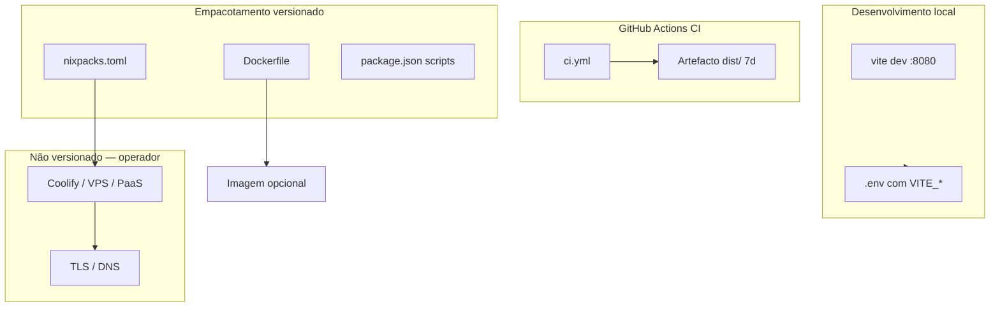
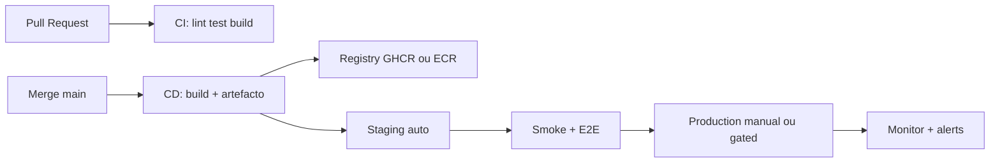

# Engenharia reversa — Deploy, DevOps, CI/CD e publicação (hapitech-main)

**Âmbito:** apenas o que está **versionado** no repositório (ficheiros de pipeline, empacotamento, scripts, configs) e menções explícitas em `docs/`.  
**Conclusão central (evidência):** existe **um** workflow GitHub Actions de **CI** (sem deploy, sem Docker build, sem push para registry). O deploy “de produção” **não** está codificado: **Nixpacks** (`nixpacks.toml`) e **Dockerfile** descrevem **como** empacotar a SPA, mas **quem** dispara o deploy (Coolify, painel manual, outro PaaS) **não** aparece em ficheiros IaC. **Coolify** é referido apenas em documentação como **implícito** ao deploy escolhido pelo operador — **não** há `coolify.yml`, compose Coolify, nem webhooks de deploy no repo.

**Ficheiros de exemplo gerados nesta análise (não ativos até copiar/ativar):**  
- `infra/ci/github-actions-cd.example.yml` — esqueleto CD com `build-args` para `VITE_*` (requer `Dockerfile` com `ARG` correspondente).

---

## 1. Resumo executivo

| Área | O que existe no repo | O que **não** existe |
|------|----------------------|----------------------|
| **CI** | `.github/workflows/ci.yml` — checkout, Node 22, `npm ci`, lint, test (`continue-on-error: true`), `npm run build`, upload `dist/` 7 dias | Deploy, SSH, registry, Coolify, staging/prod matrix |
| **CD / publicação** | **Não** versionado | Sem `workflow_dispatch` de release, sem `docker push`, sem Fly/Railway/Render configs |
| **Empacotamento** | `Dockerfile` (multi-stage → `serve`), `nixpacks.toml` (Nixpacks) | Sem alinhamento garantido entre `npm ci` (Docker) e `npm install` (Nixpacks) |
| **Supabase** | `supabase/config.toml`, `supabase/functions/*`, `supabase/migrations/*` | **Sem** workflow `supabase db push` / `functions deploy` no GitHub Actions |
| **Coolify** | Menções em `docs/*` | Zero ficheiros de configuração Coolify |
| **SSL/DNS/Proxy** | Menções em `docs/*` | Zero `nginx.conf`, `Caddyfile` (exceto exemplo em `infra/caddy/` de outra eng. reversa), `traefik.yml` |
| **Monitorização / backup / rollback** | **Não** definidos em pipeline | Operacional externo |

**Implicação para reconstrução DevOps:** é necessário **criar** pipeline CD, secrets de build (`VITE_*`), estratégia Supabase (CLI ou dashboard), e documentar hosting (Coolify ou substituto) **fora** do estado atual mínimo do repo.

---

## 2. Arquitetura DevOps atual

### 2.1 Diagrama — realidade versionada

### 2.2 Três caminhos de “publicação” possíveis (do ponto de vista do código)

1. **GitHub Actions CI** — produz `dist/` como artefacto; **não** publica em servidor (`ci.yml` L45–51).  
2. **Docker build local/CI externo** — `Dockerfile` L2–35.  
3. **Nixpacks** — plataformas que detetam `nixpacks.toml` (`nixpacks.toml` L1–11).

**Supabase (backend):** deploy de migrações e Edge Functions é via **Supabase CLI / Dashboard** — **sem** workflow no `.github/workflows/` que execute `supabase functions deploy`.

---

## 3. Fluxo deploy

### 3.1 “Deploy atual” inferido apenas a partir do repositório

O repositório **não** contém o passo que coloca `dist/` ou uma imagem Docker num servidor. O que existe é:

- **Build reproduzível em CI:** `npm run build` (`ci.yml` L43–44).  
- **Falha antecipada em runtime** se `VITE_SUPABASE_URL` / `VITE_SUPABASE_PUBLISHABLE_KEY` ausentes: `src/integrations/supabase/client.ts` L5–9 lança `Error("Missing Supabase environment variables")`.

Logo, qualquer “deploy” que rode o bundle sem definir `VITE_*` **quebra** a app no browser.

### 3.2 Coolify — como “está a ser utilizado”

**Evidência:** não há ficheiros Coolify. Referências textuais:

- `docs/INVENTARIO_SERVICOS_EXTERNOS_COMPLETO.md` L21, L348+ — “Coolify, Cloudflare, DNS … implícitos na infra escolhida”.  
- `docs/INVENTARIO_TECNOLOGIAS_COMPLETO.md` L244 — “Coolify / Nginx — **Não versionados**”.  
- `docs/RECONSTRUCAO_INFRAESTRUTURA_COMPLETA.md` L5, L76, L396 — “Coolify ou PaaS”, checklist “Subir hosting (Coolify ou outro)”.

**Conclusão:** Coolify é uma **hipótese documentada**, não uma **configuração versionada**. Não é possível afirmar a partir do Git **como** o Coolify está ligado (Dockerfile vs Nixpacks, portas, volumes) sem acesso ao painel Coolify/DNS.

### 3.3 Publicação de containers

- **Não** há job `docker build` / `docker push` no CI.  
- **Publicação** de imagem seria manual ou por plataforma que use o `Dockerfile` / Nixpacks.

---

## 4. Dependências críticas

| Dependência | Evidência | Impacto no deploy |
|-------------|-----------|-------------------|
| Node **22** | `ci.yml` L15–16, L30; `Dockerfile` L2, L20; `nixpacks.toml` L2 | Runner/plataforma deve suportar 22 |
| `npm ci` + lockfile | `ci.yml` L34; `Dockerfile` L10 | Reprodutibilidade |
| `VITE_SUPABASE_URL`, `VITE_SUPABASE_PUBLISHABLE_KEY` | `client.ts` L5–9 | **Obrigatórias** no build da SPA |
| Supabase projeto (URL + anon key) | Idem | Backend da app |
| Secrets Edge (`Deno.env`) | `supabase/functions/*` | Functions em produção |
| `npm run build` sucesso | `ci.yml` L44 | Gate de qualidade mínimo |

---

## 5. Dependências ocultas

- **`lovable-tagger`** em `vite.config.ts` L4, L15 — plugin só em `mode === "development"`; não deve afetar bundle prod, mas é **dependência de tooling** ligada ao ecossistema Lovable.  
- **Diferença Nixpacks vs Docker:** `npm install` vs `npm ci` — árvore de dependências pode divergir (`nixpacks.toml` L5 vs `Dockerfile` L10).  
- **CI sem `VITE_*`:** `ci.yml` **não** define `env:` para secrets — o build pode **passar** se o runner tiver variáveis globais **ou** se Vite não falhar em tree-shake sem aceder a env em compile-time de forma estrita — mas `client.ts` falha **em runtime** quando o bundle executa L8–9. Na prática, **testes E2E** sem env podem mascarar o problema.  
- **Edge Functions** importam URLs `esm.sh`, `deno.land` (`docs/INVENTARIO_SERVICOS_EXTERNOS_COMPLETO.md` L316) — dependência de CDN no **deploy** Deno.  
- **Domínios legados** em Edge (`*.lovable.app`, Evolution fallback) — migração DNS/SSL (`docs/INVENTARIO_SERVICOS_EXTERNOS_COMPLETO.md` L391–393).

---

## 6. Problemas segurança

| ID | Problema | Evidência |
|----|----------|-----------|
| DV1 | **Sem scan de dependências** no CI | `ci.yml` sem `npm audit` / Snyk |
| DV2 | **Testes com `continue-on-error: true`** | `ci.yml` L39–41 — pipeline pode ficar “verde” com testes a falhar |
| DV3 | **Sem validação de secrets** no CI | Não há `VITE_*` obrigatórios no YAML |
| DV4 | **Artefacto `dist` público** no GitHub (quem tem acesso ao repo) | `upload-artifact` L46–51 — risco de vazamento de build com env injetada se secrets forem usados mais tarde |
| DV5 | **Literais sensíveis / infra antiga** no código Edge | `docs/AUDITORIA_VARIAVEIS_SEGREDOS_COMPLETA.md`; Evolution defaults |
| DV6 | **Sem assinatura de commits / proveniência** no workflow | Não exige `oidc` ou deploy protegido |

---

## 7. Problemas CI/CD

- **CD inexistente** no sentido clássico (nenhum ambiente é atualizado pelo workflow).  
- **Sem matriz** `staging` / `production`.  
- **Sem cache de Docker layers** (não há build Docker no CI).  
- **Sem notificação** (Slack, e-mail) em falha de build.

---

## 8. Problemas deploy

- **Drift:** CI usa `npm ci`, Nixpacks usa `npm install` — artefactos podem diferir.  
- **`docs/RECONSTRUCAO_INFRAESTRUTURA_COMPLETA.md` L72–73** diz `Dockerfile` **não encontrado** — o repositório atual **contém** `Dockerfile` na raiz; o doc está **desatualizado** em relação ao ZIP/workspace atual.  
- **Supabase** não faz parte do pipeline — risco de migrações aplicadas manualmente sem PR.

---

## 9. Problemas rollback

- **Não há** versionamento de imagem por tag no CI (não há push).  
- **Rollback** seria: redeploy de commit anterior no hosting + eventual restore Supabase (manual).  
- **Artefacto** `dist` retido 7 dias (`ci.yml` L51) — rollback curto só desse binário, não do estado servidor.

---

## 10. Problemas monitoramento

- **Não há** integração APM (Sentry, Datadog, OpenTelemetry) nos workflows.  
- **Healthchecks** de deploy não estão no CI (após deploy smoke test).

---

## 11. Dependências ambiente antigo

- **Domínios `*.lovable.app`** em funções e defaults (`docs/INVENTARIO_SERVICOS_EXTERNOS_COMPLETO.md` L392–393).  
- **Evolution** URL/chave fallback (`wuzapi-proxy`, `whatsapp-webhook`).  
- **`project_id`** em `supabase/config.toml` L1 — acoplamento a projeto Supabase legado.  
- **Coolify/DNS/SSL “antigos”:** apenas se o operador os usou — **não** há ficheiros para datar.

---

## 12. Plano reconstrução (DevOps do zero)

1. **Fonte da verdade:** Git + branch protection + PR obrigatório.  
2. **Secrets:** GitHub Environments `staging` / `production` com `VITE_*` e tokens Supabase para CLI se necessário.  
3. **CI:** manter lint + testes **sem** `continue-on-error` em `main` (ou job separado “nightly” com tolerância).  
4. **CD:** adicionar workflow que: build com `VITE_*` → Docker push **ou** upload para S3/Cloudflare Pages → invalidação cache.  
5. **Dockerfile:** adicionar `ARG`/`ENV` para `VITE_*` antes de `npm run build` (alinhar com `infra/ci/github-actions-cd.example.yml`).  
6. **Supabase:** job `supabase link` + `db push` / `functions deploy` com `SUPABASE_ACCESS_TOKEN` (avaliar risco — preferir manual ou ambiente isolado).  
7. **Observabilidade:** Sentry DSN no front; logs Edge no dashboard Supabase.  
8. **Runbook:** rollback, contacto DNS, RTO/RPO.

---

## 13. Plano migração

| Reutilizar | Não reutilizar | Recriar | Rotacionar |
|------------|----------------|---------|------------|
| `ci.yml` como base | Runner secrets do projeto antigo se comprometidos | Workflows CD + environments | `VITE_*`, keys Supabase, Evolution |
| `nixpacks.toml` / `Dockerfile` | Imagem com URLs antigas baked-in | DNS para novo domínio | JWT anon se repo foi público com leak |

---

## 14. Nova arquitetura DevOps recomendada

### 14.1 Diagrama alvo

### 14.2 Pipeline CI/CD recomendado (texto)

- **PR:** `npm ci` → lint → test **bloqueante** → `npm run build` com `VITE_*` de **staging** (secrets environment `pull_request`).  
- **Main:** mesmo + `docker build` com tags `sha-<short>`, `main-latest` → push GHCR.  
- **Staging:** deploy automático para URL `staging.app...` (Coolify **ou** Kubernetes **ou** Fly.io — escolha única documentada).  
- **Production:** aprovação manual (GitHub Environment `production` required reviewers) + deploy + smoke `curl` 200.

**Ficheiro exemplo:** `infra/ci/github-actions-cd.example.yml` — login GHCR + `docker/build-push-action` com `build-args` para `VITE_*` (**requer** estender `Dockerfile`).

### 14.3 Estratégia staging / production

- **Staging:** projeto Supabase **separado** (recomendado) ou mesmo projeto com schema prefix — evitar dados reais.  
- **Production:** apenas a partir de tags `v*` ou release aprovada.

### 14.4 Rollback

- Manter **N** imagens anteriores no registry; `docker pull` tag anterior no host **ou** feature “rollback” no PaaS.  
- Supabase: migrações reversíveis (`down`) ou backup PITR.

### 14.5 Monitoramento

- Uptime HTTP externo (Better Stack, Pingdom, etc.).  
- Sentry no front.  
- Alertas Supabase (quota, erro rate Functions).

### 14.6 Backup

- Supabase backups automáticos (plano pago) + export periódico `pg_dump` para object storage.  
- Export de secrets inventory (`docs/AUDITORIA_VARIAVEIS_SEGREDOS_COMPLETA.md` como metodologia).

### 14.7 Observabilidade

- Correlação `trace_id` em Edge Functions (adicionar header propagado).  
- Dashboards: latência P95 `functions/v1/*`, taxa 5xx.

### 14.8 Segurança

- OIDC para cloud deploy em vez de long-lived SSH keys.  
- `npm audit` em CI com threshold.  
- Secret scanning GitHub habilitado.

---

## 15. Checklist deploy

- [ ] Definir `VITE_SUPABASE_URL` e `VITE_SUPABASE_PUBLISHABLE_KEY` no sistema de build  
- [ ] Validar `npm run build` local com `.env` espelhando produção  
- [ ] Publicar `dist/` ou imagem com digest imutável  
- [ ] Configurar TLS e HSTS no edge  
- [ ] `supabase secrets set` para todas as Edge  
- [ ] `supabase functions deploy` / migrações aplicadas  
- [ ] Webhooks externos (Asaas, Evolution, Telegram) apontando para URLs **HTTPS** finais  
- [ ] Smoke test pós-deploy (`/`, login, uma function crítica)

---

## 16. Checklist segurança

- [ ] Remover `continue-on-error` dos testes em `main` (ou política explícita)  
- [ ] Secrets só em GitHub Environments / vault — não em `vite` hardcoded  
- [ ] Rotacionar chaves após migração de repo  
- [ ] Branch protection + required checks  
- [ ] Scan de imagem Docker (Trivy) no CD  
- [ ] Auditar `verify_jwt` nas Edge (`supabase/config.toml`)

---

## 17. Checklist CI/CD

- [ ] Job de build com `env: VITE_*` ou `build-args` Docker  
- [ ] Cache `actions/setup-node` com `cache: npm` (já presente `ci.yml` L31)  
- [ ] Artefacto `dist` com retenção alinhada à política (7d atual)  
- [ ] Workflow separado para release/tag  
- [ ] Concurrency group para evitar deploys sobrepostos

---

## 18. Checklist rollback

- [ ] Tag de imagem por `git sha` preservada  
- [ ] Documentar comando de rollback no host (Coolify UI ou `helm rollback`)  
- [ ] Plano de restore Supabase (PITR ou backup)  
- [ ] Verificar compatibilidade de migrações DB ao reverter versão app

---

## 19. Checklist observabilidade

- [ ] Health URL pública  
- [ ] Alertas de erro 5xx no edge  
- [ ] Logs centralizados (Loki / CloudWatch) se VM  
- [ ] RUM opcional (web-vitals)

---

# ANALISE DETALHADAMENTE (pedido explícito)

## Coolify

- **Config versionada:** nenhuma.  
- **Uso inferido:** texto em `docs/INVENTARIO_TECNOLOGIAS_COMPLETO.md` L244; `docs/RECONSTRUCAO_INFRAESTRUTURA_COMPLETA.md` L76 “Deploy típico Coolify ou PaaS”.

## Docker

- `Dockerfile` raiz — multi-stage, `serve` porta 3000 (`Dockerfile` L19–35).  
- Detalhes de endurecimento/ARG: ver `docs/ENGENHARIA_REVERSA_DOCKER_ORQUESTRACAO_COMPLETA.md`.

## docker-compose

- Originalmente ausente; exemplo de stack em `infra/docker-compose.stack.example.yml` (documento Docker anterior).

## Scripts deploy

- **Não** há `scripts/deploy.sh`, `Makefile` de deploy, etc. (pesquisas anteriores no projeto).

## CI/CD — GitHub Actions

- **Único workflow:** `.github/workflows/ci.yml`  
  - **Triggers:** `push` e `pull_request` para `main`, `master`, `develop` (`ci.yml` L3–13).  
  - **Runner:** `ubuntu-latest` (`ci.yml` L21).  
  - **Steps:** checkout v4, setup-node v4 com cache npm, `npm ci`, lint, test (continue on error), build, upload-artifact (`ci.yml` L24–51).

## GitLab CI

- **Não** existe `.gitlab-ci.yml` (glob 0).

## Webhooks deploy

- **Não** há webhooks de GitHub → Coolify no repo.  
- **Webhooks de produto** (Asaas, Evolution, Telegram) são **outros** domínios — ver Edge Functions, não CI.

## Registries Docker

- **Não** referenciados no CI.  
- Exemplo GHCR em `infra/ci/github-actions-cd.example.yml` L9–10, L30–35.

## SSH deploy

- **Não** há `appleboy/ssh-action` ou equivalente no workflow.

## Proxy reverso / Nginx / Traefik / SSL / DNS

- **Não** versionados; menções em `docs/INVENTARIO_SERVICOS_EXTERNOS_COMPLETO.md` L342, L348.

## Staging / production

- **Não** há branches ou environments definidos no YAML além dos triggers de branch.

## Rollback / monitoramento / healthchecks / backups

- **Não** no CI/CD versionado; responsabilidade do operador/plataforma.

---

# IDENTIFIQUE (lista consolidada)

- **Estratégia deploy atual (repo):** *não codificada* — apenas empacotamento + CI build.  
- **Pipeline CI/CD:** só **CI** (`ci.yml`).  
- **Deploy automático:** **não** evidenciado no Git.  
- **Deploy manual:** implícito (operador).  
- **Dependências Git:** branches `main`/`master`/`develop` acionam CI.  
- **Dependências Coolify/DNS/SSL/proxy/SSH/registry/webhooks deploy:** **não** em ficheiros — apenas docs.

---

# EXPLIQUE DETALHADAMENTE (fluxos 1–12)

1. **Deploy hoje (repo):** indefinido; CI produz artefacto.  
2. **Fluxo completo deploy (recomendado alvo):** merge → CD → registry → pull no servidor → healthcheck.  
3. **Fluxo build:** `npm run build` (Vite) — `package.json` L8; no CI `ci.yml` L44.  
4. **Fluxo containers:** opcional via `Dockerfile`; não acionado pelo CI atual.  
5. **Fluxo CI/CD:** só CI até ao passo build+artefacto.  
6. **Fluxo rollback:** manual; ver checklist 18.  
7. **Fluxo staging:** não versionado — definir ambiente GitHub + URL staging.  
8. **Fluxo production:** não versionado.  
9. **Fluxo SSL/TLS:** responsabilidade do edge (Coolify/Nginx/Caddy/Cloudflare).  
10. **Fluxo DNS:** idem.  
11. **Fluxo monitoramento:** adicionar ferramentas externas.  
12. **Fluxo backup:** Supabase + política de artefactos/registry.

---

# IDENTIFIQUE TAMBÉM (itens “ocultos” / antigos)

- **Scripts ocultos:** nenhum no repo; possíveis scripts **só no servidor** Coolify (invisíveis ao Git).  
- **Automações ocultas:** agendamentos Supabase (cron) para Edge `check-inactivity` etc. — configurados no **dashboard Supabase**, não no GitHub.  
- **Registries privados:** não referenciados.  
- **Tokens deploy / deploy keys / SSH keys:** não no repositório (bom — não commitar).  
- **Domínios/SSL/DNS/Coolify/Git/VPS antigos:** rastreados via docs e fallbacks em Edge, não via pipeline.

---

# ANÁLISE DE SEGURANÇA (tabela pedida)

| Risco | Estado |
|-------|--------|
| SSH inseguro | Não aplicável — não há SSH no CI |
| Deploy sem validação | CI não faz deploy; risco transfere-se ao processo manual |
| Secrets expostos | Literais em Edge; `VITE_*` devem vir de secrets de build |
| CI/CD inseguro | Testes não bloqueantes; sem audit |
| Tokens expostos | Não no YAML; risco em código |
| Registries inseguros | N/A |
| SSL ausente | Fora do repo |
| Rollback inexistente | No CI, sim |
| Backup inexistente | No CI, sim |
| Monitoramento ausente | No CI, sim |

---

# ANÁLISE OPERACIONAL

| Evento | Impacto |
|--------|---------|
| Deploy falha | Sem CD automático — impacto depende do processo manual |
| VPS cai | App indisponível até restore |
| DNS falha | Cliente não resolve host |
| SSL expira | Browsers bloqueiam; OAuth/webhooks quebram |
| Coolify cai | Sem IaC no repo — recuperação depende de backup do painel |
| Registry falha | Sem CD — impacto futuro se adotarem registry |
| Rollback falha | Downtime prolongado; dados possivelmente incompatíveis |

---

# RECONSTRUÇÃO COMPLETA (passos 1–13)

1. **Deploy do zero:** escolher hosting → configurar secrets `VITE_*` → primeiro `npm run build` → publicar `dist` ou imagem.  
2. **Pipeline CI/CD:** estender `ci.yml` ou adicionar `cd.yml` com ambientes.  
3. **Staging:** URL + Supabase projeto staging + secrets `pull_request` ou branch `develop`.  
4. **Production:** environment protegido + deploy só após aprovação.  
5. **Docker:** alinhar `Dockerfile` com build-args (`infra/ci/github-actions-cd.example.yml`).  
6. **Proxy reverso:** ver `infra/caddy/Caddyfile.example` (stack exemplo Docker).  
7. **SSL:** Let's Encrypt no proxy ou TLS gerido pelo PaaS.  
8. **DNS:** CNAME/A para edge.  
9. **Rollback:** tags imutáveis + runbook.  
10. **Monitoramento:** uptime + Sentry.  
11. **Backup:** Supabase + Git tags.  
12. **Segurança:** branch protection, secret scanning, remover fallbacks sensíveis.  
13. **Validação:** smoke automatizado pós-deploy.

---

# GERAR (estratégias — resumo executável)

- Arquitetura, pipeline, staging/prod, rollback, backup, observabilidade, segurança: ver **secção 14** e checklists **15–19**.  
- **Ficheiro gerado:** `infra/ci/github-actions-cd.example.yml`.

---

# ANÁLISE DE MIGRAÇÃO

- **Reutilizar:** `ci.yml` como base de qualidade; `package.json` scripts; estrutura Supabase.  
- **Não reutilizar:** processos manuais não documentados; secrets antigos se houve leak.  
- **Recriar:** CD completo, política de ambientes, observabilidade.  
- **Rotacionar:** todas as chaves públicas/privadas ligadas ao domínio antigo.  
- **Dependente ambiente antigo:** fallbacks `lovable.app`, Evolution, `project_id` Supabase.  
- **Dependente Coolify/Git/DNS/SSL antigo:** apenas se o operador os usou — **sem prova** no repo além de `docs/`.

---

# Ficheiros relacionados (inventário)

| Caminho | Papel |
|---------|--------|
| `.github/workflows/ci.yml` | Único CI versionado |
| `package.json` | Scripts `build`, `start`, `lint`, `test` |
| `nixpacks.toml` | Plano Nixpacks (PaaS) |
| `Dockerfile` | Imagem SPA (opcional) |
| `vite.config.ts` | Dev server `:8080`, plugin `lovable-tagger` em dev |
| `src/integrations/supabase/client.ts` | Exigência `VITE_*` em runtime |
| `supabase/config.toml` | Deploy Edge (manual típico) |
| `infra/ci/github-actions-cd.example.yml` | **Novo** — esqueleto CD |
| `docs/RECONSTRUCAO_INFRAESTRUTURA_COMPLETA.md` | Visão reconstrução (nota: secção 2.5 pode estar desatualizada sobre `Dockerfile`) |
| `docs/INVENTARIO_TECNOLOGIAS_COMPLETO.md` L240–244, L347–352 | Docker / deploy / requisitos |
| `docs/AUDITORIA_VARIAVEIS_SEGREDOS_COMPLETA.md` L163–168, L219–224 | CI sem `VITE_*`, gaps |

---

*Documento baseado no estado do workspace `hapitech-main`. Divergências entre ZIP recebido e Git remoto podem existir — alinhar `docs/RECONSTRUCAO_INFRAESTRUTURA_COMPLETA.md` com a existência atual do `Dockerfile`.*
