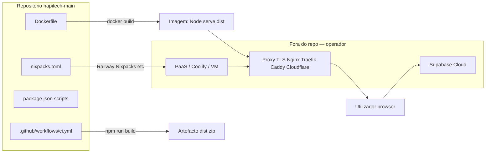
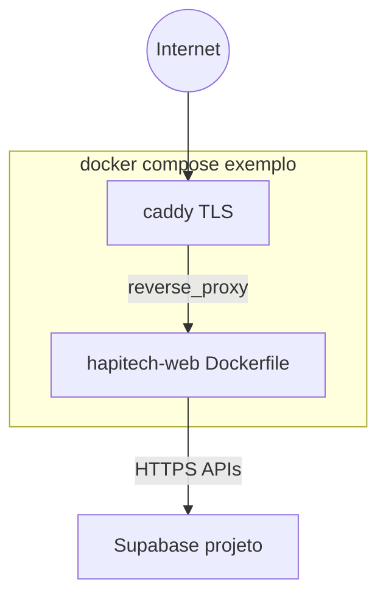

# Engenharia reversa — Docker e orquestração (hapitech-main)

**Âmbito:** apenas o que está **versionado** neste repositório e referências explícitas em documentação interna.  
**Conclusão antecipada (evidência):** existe **um** `Dockerfile` na raiz; **não** existem `docker-compose.yml`, `docker-compose.prod.yml`, `docker-compose.dev.yml`, `.dockerignore`, Helm, Kubernetes manifests, nem scripts `deploy*.sh` no projeto. A orquestração multi-container **não** faz parte do código-fonte atual; o deploy esperado passa por **Nixpacks** (`nixpacks.toml`) e/ou **plataforma externa** (Coolify, PaaS, CDN) mencionada em `docs/` mas **não** configurada em ficheiros IaC aqui.

**Ficheiros novos gerados por este trabalho (exemplo de reconstrução):**  
- `infra/docker-compose.stack.example.yml`  
- `infra/caddy/Caddyfile.example`  

Estes **não** substituem CI nem Dockerfile existentes; são **referência** para um ambiente novo (secção 14).

---

## 1. Resumo executivo

| Tópico | Estado no repositório |
|--------|------------------------|
| **Dockerfile** | Sim — build multi-stage Node 22 Alpine → `serve` na porta 3000 |
| **docker-compose** (qualquer variante) | **Não** existia; exemplo novo em `infra/` |
| **Networks / volumes / restart** no repo | **Não** definidos (sem Compose até ao exemplo) |
| **Proxy reverso (Nginx/Traefik/Caddy)** | **Não** versionado; exemplo Caddy em `infra/caddy/` |
| **Coolify** | Apenas menções em `docs/` — não há `coolify.yml` nem stack |
| **CI Docker build/push** | **Não** — `.github/workflows/ci.yml` só Node + artefacto `dist/` |
| **Supabase / Evolution em Docker** | **Não** orquestrados neste repo (Supabase tipicamente cloud; Evolution seria stack à parte) |

**Implicação para reconstrução:** o operador deve trazer **proxy TLS**, **DNS**, **secrets de build** (`VITE_*`) e eventualmente **Compose** próprio; o repositório sozinho **não** descreve uma stack completa de produção containerizada além da imagem da SPA.

---

## 2. Arquitetura Docker (o que o repo define)

### 2.1 Diagrama — realidade do repositório (antes do exemplo `infra/`)



### 2.2 Diagrama — arquitetura **recomendada** (alinhada ao ficheiro gerado `infra/docker-compose.stack.example.yml`)



---

## 3. Fluxo operacional (como a infra “sobe” hoje, por evidência)

### 3.1 Caminho A — Imagem Docker local ou registry

1. `docker build -t hapitech-web:local -f Dockerfile .` na raiz (`Dockerfile` L1–35).  
2. Stage **builder:** `FROM node:22-alpine AS builder` → `npm ci` → `npm run build` (`Dockerfile` L2–17).  
3. Stage **final:** `FROM node:22-alpine` → `npm install -g serve` → `COPY --from=builder /app/dist` → `EXPOSE 3000` → `CMD ["serve", "dist", "-s", "-l", "3000"]` (`Dockerfile` L19–35).  
4. **Ordem de inicialização** dentro da imagem: um único processo PID 1 = `serve` — **sem** `depends_on`, **sem** sidecars no repo.

### 3.2 Caminho B — Nixpacks (Railway, Coolify com detetor Nixpacks, etc.)

1. Fase `setup`: `nodejs-22_x` (`nixpacks.toml` L1–2).  
2. `install`: `npm install` (`nixpacks.toml` L4–5).  
3. `build`: `npm run build` (`nixpacks.toml` L7–8).  
4. `start`: `npm run start` (`nixpacks.toml` L10–11), que corresponde a `serve dist -s -l 3000` (`package.json` L10).

### 3.3 Caminho C — CI GitHub Actions

1. Checkout, Node 22, `npm ci`, `npm run lint`, `npm run test` (continua mesmo com erro), `npm run build` (`.github/workflows/ci.yml` L24–44).  
2. Upload artefacto `dist/` — **não** há `docker build` nem `docker compose` no workflow.

---

## 4. Dependências críticas

| Dependência | Evidência | Se falhar |
|-------------|-----------|-----------|
| `node:22-alpine` (Docker Hub) | `Dockerfile` L2, L20 | Build/pull da imagem falha |
| `npm ci` + lockfile | `Dockerfile` L8–10 | Build reprodutível quebrada |
| `vite build` | `Dockerfile` L17; `package.json` L8 | Sem pasta `dist/` |
| `serve` global no stage final | `Dockerfile` L23, L35 | Container sobe sem servidor HTTP |
| **Variáveis `VITE_*` no momento do build** | **Não** declaradas no `Dockerfile` | Imagem pode embutir URLs vazias/erradas (`docs/AUDITORIA_VARIAVEIS_SEGREDOS_COMPLETA.md` L163) |

---

## 5. Dependências ocultas

- **Imagem oficial Node** puxada de registo público (Docker Hub) — política corporativa de mirror não está no repo.  
- **Nixpacks** usa `npm install` em vez de `npm ci` (`nixpacks.toml` L5 vs `Dockerfile` L10) — **dois caminhos** com comportamento de dependências **ligeiramente diferente**.  
- **Coolify / Traefik / Nginx / Cloudflare:** implícitos em `docs/RECONSTRUCAO_INFRAESTRUTURA_COMPLETA.md` L242–244 e `docs/INVENTARIO_TECNOLOGIAS_COMPLETO.md` L244 — **não** há ficheiros de configuração.  
- **Supabase Edge / Evolution:** não são serviços definidos em Docker neste repo; comunicação HTTPS a partir do browser e das Edge Functions.

---

## 6. Problemas segurança

| ID | Problema | Evidência |
|----|----------|-----------|
| D1 | **Sem utilizador não-root** no `Dockerfile` | Processo corre como root no container por defeito Alpine (`Dockerfile` L19–35) — `docs/AUDITORIA_SEGURANCA_COMPLETA.md` L131 |
| D2 | **Sem `.dockerignore`** | Ausência confirmada por pesquisa de ficheiros — contexto de build envia **todo** o diretório (`.git`, `node_modules` se existir no host, etc.) |
| D3 | **Sem ARG/ENV para `VITE_*` no build** | `Dockerfile` não define `ARG`/`ENV` antes de `npm run build` — risco de build “cego” (`docs/AUDITORIA_VARIAVEIS_SEGREDOS_COMPLETA.md` L163) |
| D4 | **EXPOSE 3000** sem TLS dentro do container | `Dockerfile` L32 — TLS deve ser **fora** (proxy) |
| D5 | **Sem healthcheck no Dockerfile** | `Dockerfile` completo L1–35 não contém `HEALTHCHECK` |
| D6 | **Secrets Docker** (Docker secrets / swarm) | Não usados — `docs/AUDITORIA_VARIAVEIS_SEGREDOS_COMPLETA.md` L194 |

---

## 7. Problemas persistência

- O container da SPA é **efémero**: o único estado persistente relevante é o **conteúdo estático** em `/app/dist` **dentro da imagem**. **Não** há volumes nomeados no `Dockerfile` para uploads ou sessão.  
- **Uploads / dados:** persistem em **Supabase Storage / Postgres** (fora deste Docker).  
- **Sessão WhatsApp (Evolution):** fora deste repo — ver `docs/ENGENHARIA_REVERSA_WHATSAPP_EVOLUTION_COMPLETA.md`.

---

## 8. Problemas containers

- **Um único tipo de container** definido: frontend estático + `serve` — **não** há container “backend” Node com API neste repo (backend = Supabase).  
- **Stateful vs stateless:** a imagem gerada é **stateless** (reiniciar perde apenas memória volátil; `dist` é read-only na imagem).  
- **Privilegiados / Docker socket:** não há `privileged: true` nem montagem `/var/run/docker.sock` — **porque não há Compose no repo original**.

---

## 9. Problemas networks

- **Não aplicável** no `Dockerfile` isolado.  
- No exemplo `infra/docker-compose.stack.example.yml`: duas redes `internal` e `edge` (bridge) — **documentadas no ficheiro**; o serviço `hapitech-web` só precisa de `internal`; Caddy une `internal` + `edge`.

---

## 10. Problemas deploy

- **CI não publica imagem** — risco de “drift” entre build local Docker e build CI (`ci.yml` não tem `docker push`).  
- **Dois modelos** (Dockerfile `npm ci` vs Nixpacks `npm install`) podem gerar **artefactos diferentes** para o mesmo commit.  
- Documento `docs/RECONSTRUCAO_INFRAESTRUTURA_COMPLETA.md` L72–73 afirma `Dockerfile` **não encontrado** — **desatualizado** em relação ao estado atual do repo (o `Dockerfile` existe na raiz).

---

## 11. Dependências ambiente antigo

- **Coolify / DNS / SSL antigo:** apenas texto em `docs/INVENTARIO_SERVICOS_EXTERNOS_COMPLETO.md` L21, L348+; `docs/RECONSTRUCAO_INFRAESTRUTURA_COMPLETA.md` L5, L76, L396.  
- **Nenhum** hostname ou certificado está hardcoded no `Dockerfile`.

---

## 12. Plano reconstrução

1. Fixar **uma** estratégia de build: preferir `npm ci` em **todos** os caminhos (alinhar `nixpacks.toml` a `npm ci` se política o exigir).  
2. Adicionar **`.dockerignore`** (excluir `node_modules`, `.git`, `dist`, `.env*`).  
3. Estender `Dockerfile` com `ARG`/`ENV` para `VITE_SUPABASE_URL`, `VITE_SUPABASE_PUBLISHABLE_KEY`, etc., e `RUN npm run build` **depois** de exportar ENV — ou usar build multi-stage com `--build-arg` no CI.  
4. Usar `USER node` (criar utilizador) após instalar `serve` — endurecimento.  
5. Subir **Compose** de produção (ex.: ficheiro em `infra/`) com **Caddy/Traefik/Nginx** para TLS e headers.  
6. Manter **Supabase** como projeto cloud (recomendado) ou self-host Supabase **fora** deste repositório (stack oficial Supabase).  
7. Evolution API: stack **separada** ou bloco comentado no compose exemplo.

---

## 13. Plano migração

| Reutilizar | Não reutilizar | Recriar | Rotacionar |
|------------|----------------|---------|------------|
| `Dockerfile` como base | Imagem antiga com `VITE_*` errados baked-in | Compose + proxy no novo ambiente | Registos / tokens em `.env` de build |
| `nixpacks.toml` se plataforma suportar | Cache de `npm install` inconsistente | DNS e certificados TLS | Qualquer secret em imagens antigas no registry |

---

## 14. Novo docker-compose recomendado

**Ficheiro gerado:** `infra/docker-compose.stack.example.yml`

**Conteúdo resumido (evidência — abrir o YAML):**

- **Serviço `hapitech-web`:** `build.context: ..`, `dockerfile: Dockerfile`, `expose: "3000"`, `restart: unless-stopped`, **healthcheck** com `node` + `fetch` para `http://127.0.0.1:3000/`, rede `internal`.  
- **Serviço `caddy`:** imagem `caddy:2-alpine`, portas `80`/`443`, volumes `caddy_data` / `caddy_config`, montagem `infra/caddy/Caddyfile.example` → `/etc/caddy/Caddyfile`, `depends_on` com `condition: service_healthy`, variáveis `DOMAIN` e `ACME_EMAIL`.  
- **Redes:** `internal` (bridge), `edge` (bridge).  
- **Evolution:** bloco comentado — ativar só com política de segurança e volumes próprios.

**Caddyfile exemplo:** `infra/caddy/Caddyfile.example` — bloco global `email {$ACME_EMAIL}` e site `{$DOMAIN}` com `reverse_proxy hapitech-web:3000` e headers mínimos.

**Comandos (a partir da raiz do repo):**

```bash
# Build e subida do exemplo (definir DOMAIN e ACME_EMAIL no ambiente ou .env)
set DOMAIN=app.exemplo.com
set ACME_EMAIL=ops@exemplo.com
docker compose -f infra/docker-compose.stack.example.yml build
docker compose -f infra/docker-compose.stack.example.yml up -d
docker compose -f infra/docker-compose.stack.example.yml ps
docker compose -f infra/docker-compose.stack.example.yml logs -f hapitech-web
```

**Build com variáveis Vite (exemplo):**

```bash
docker build -f Dockerfile ^
  --build-arg VITE_SUPABASE_URL=https://xxxx.supabase.co ^
  --build-arg VITE_SUPABASE_PUBLISHABLE_KEY=eyJhbGciOi... ^
  -t hapitech-web:prod .
```

*Nota:* o `Dockerfile` atual **não** declara estes `ARG`; para o comando acima funcionar, é necessário **alterar o Dockerfile** (fora do escopo mínimo deste doc) ou injetar `.env` numa ferramenta de build que o Vite leia durante `docker build`.

---

## 15. Checklist deploy

- [ ] Escolher: **só Docker** / **Nixpacks** / **artefacto estático S3+CDN**  
- [ ] Definir todas as `VITE_*` antes do `npm run build`  
- [ ] `docker build` com tags versionadas (`:1.2.3`)  
- [ ] TLS no edge (Caddy/Nginx/Traefik/Cloudflare)  
- [ ] Healthcheck no orquestrador (Compose/K8s) ou no Dockerfile  
- [ ] Limitar CPU/memória no runtime (Compose `deploy` só em Swarm; usar alternativas em Compose v2)  
- [ ] Logging agregado (driver `json-file` + rotação ou Loki)

---

## 16. Checklist segurança

- [ ] Adicionar `.dockerignore`  
- [ ] Utilizador não-root no container  
- [ ] Não commitar `.env` com secrets  
- [ ] Scan de imagem (Trivy, Grype) no CI  
- [ ] Pin de digest SHA das imagens base `node:22-alpine@sha256:...`  
- [ ] Headers de segurança no proxy (ver `Caddyfile.example`)  
- [ ] Desativar exposição direta da porta 3000 na internet (só via proxy)

---

## 17. Checklist backup

- [ ] Backup **não** é do container SPA (imagem reproduzível) — backup é **código + lockfile + pipeline**  
- [ ] Backup de dados: **Supabase** (PG + Storage)  
- [ ] Se usar volumes Caddy: backup de `caddy_data` (certificados e estado ACME)

---

## 18. Checklist monitoramento

- [ ] HTTP check no URL público (200 em `/`)  
- [ ] Métricas do host (CPU/mem do processo `serve`)  
- [ ] Alertas 5xx no proxy  
- [ ] Correlacionar com Supabase Dashboard (API, Edge Functions)

---

# Análise detalhada pedida (item a item)

## Dockerfile — linha a linha (evidência)

| Linhas | Conteúdo | Implicação multi-stage / build |
|--------|----------|----------------------------------|
| L1 | Comentário Node 22 | Documentação |
| L2 | `FROM node:22-alpine AS builder` | Stage 1 — **build args não declarados** |
| L5 | `WORKDIR /app` | Diretório de trabalho |
| L8–10 | `COPY package*.json` + `RUN npm ci` | Reprodutibilidade **boa** neste stage |
| L14–15 | `COPY . .` | **Sem `.dockerignore`** aumenta contexto e risco de vazar ficheiros locais |
| L17 | `RUN npm run build` | Vite — precisa `VITE_*` no ambiente de build |
| L20 | `FROM node:22-alpine` | Stage 2 — imagem final mais pequena que builder se layers forem cacheados corretamente |
| L23 | `RUN npm install -g serve` | Dependência global npm |
| L29 | `COPY --from=builder /app/dist` | Apenas estático — **sem** código fonte na imagem final |
| L32 | `EXPOSE 3000` | Documentação de porta; não publica automaticamente |
| L35 | `CMD ["serve", "dist", "-s", "-l", "3000"]` | SPA routing `-s` |

**Multi-stage:** sim — dois `FROM` (`Dockerfile` L2 e L20).  
**Build args:** **não** presentes.  
**Healthcheck:** **ausente** no Dockerfile.

## docker-compose / docker-compose.prod / docker-compose.dev

- **Resultado de pesquisa:** `Glob **/docker-compose*` → **0 ficheiros** no estado original do repo.  
- **Exemplo novo:** `infra/docker-compose.stack.example.yml` (adicionado nesta engenharia reversa).

## Scripts deploy

- **Não** há `deploy.sh`, `scripts/docker-publish.sh`, etc. (pesquisa `deploy*.{sh,yml}` vazia).  
- Deploy efetivo = **manual** ou **plataforma** (Coolify UI, Railway, etc.) + `nixpacks.toml` / `Dockerfile`.

## Configs Docker adicionais

- **Apenas** `Dockerfile` + exemplo em `infra/`.  
- **Sem** BuildKit bake, **sem** `compose.override.yml`.

## Networks — bridge

- No **Dockerfile** isolado: rede default bridge do daemon.  
- No **compose exemplo**: `driver: bridge` explícito para `internal` e `edge`.

## Proxy reverso — Nginx / Traefik / Coolify

- **Nginx/Traefik:** não há ficheiros `nginx.conf`, `traefik.yml` no repo.  
- **Coolify:** mencionado em documentação; **sem** ficheiro de stack Coolify versionado.  
- **Caddy:** introduzido apenas como **exemplo** em `infra/caddy/Caddyfile.example`.

## Restart policies

- **Dockerfile:** não aplica (é responsabilidade do orchestrator).  
- **Compose exemplo:** `restart: unless-stopped` em `hapitech-web` e `caddy`.

## Volumes / binds / storage persistente

- **Dockerfile:** nenhum `VOLUME`.  
- **Compose exemplo:** `caddy_data`, `caddy_config` nomeados; Evolution comentado com volume sugerido.

## Healthcheck / depends_on

- **Dockerfile:** ausente.  
- **Compose exemplo:** `healthcheck` no `hapitech-web`; `depends_on` + `condition: service_healthy` no Caddy.

## Variáveis ENV / secrets / build args

- **Dockerfile:** nenhum `ENV`/`ARG` para a aplicação.  
- **Compose exemplo:** `DOMAIN`, `ACME_EMAIL` para Caddy; comentário no compose sobre `VITE_*` no build.

---

# IDENTIFIQUE (containers por categoria)

| Categoria | Definido no repo? | Notas |
|-----------|-------------------|--------|
| Frontend | **Sim** (`Dockerfile` → `serve dist`) | Único container “da app” |
| Backend app | **Não** | API = Supabase remoto |
| Supabase | **Não** | Não há `supabase start` dockerizado neste compose |
| Evolution API | **Não** (opcional comentado no exemplo) | Ver doc WhatsApp |
| Banco / Redis / Mongo | **Não** | Não faz parte deste IaC |
| Proxy | **Não** no original; **sim** no exemplo (Caddy) | |
| Serviços auxiliares | **Não** | Sem Redis cache app, sem worker |
| Críticos | **Frontend** para UX; **dados** estão fora | |
| Stateful | **Nenhum** no Dockerfile; Caddy volumes **stateful** para TLS | |
| Stateless | **hapitech-web** idealmente stateless | |

---

# EXPLIQUE DETALHADAMENTE (fluxos 1–13)

1. **Como a infra sobe (Docker):** build imagem → run container com publish da porta 3000 (manual) ou via Compose exemplo com Caddy.  
2. **Ordem inicialização (Compose exemplo):** `hapitech-web` sobe primeiro; Caddy espera `service_healthy` (`infra/docker-compose.stack.example.yml`).  
3. **Dependências entre containers:** no exemplo, Caddy depende do web; **sem** `depends_on` no Dockerfile single-container.  
4. **Fluxo rede:** browser → 443 Caddy → reverse_proxy → `hapitech-web:3000` na rede `internal`.  
5. **Fluxo proxy reverso:** TLS termina no Caddy; backend interno HTTP.  
6. **Fluxo persistência:** apenas volumes Caddy no exemplo; app estática na imagem.  
7. **Fluxo volumes:** `caddy_data` para ACME; comentário Evolution para instâncias.  
8. **Fluxo deploy:** build-time secrets para Vite; runtime sem secrets na SPA se bem configurado.  
9. **Fluxo restart:** `unless-stopped` recoloca container após reboot do host.  
10. **Fluxo SSL:** Caddy obtém cert Let's Encrypt com `email` global (`Caddyfile.example` L3–5).  
11. **Fluxo webhooks:** não passa pelo Docker da SPA — vai a Supabase Edge (`docs` Edge Functions).  
12. **Fluxo WhatsApp:** Evolution externo; não containerizado no repo original.  
13. **Fluxo Supabase:** cliente browser → projeto Supabase na cloud; **não** definido em Docker neste repositório.

---

# IDENTIFIQUE TAMBÉM (riscos e lacunas)

- **Volumes críticos (exemplo):** `caddy_data` (perder = novo ACME / risco rate limit).  
- **Secrets Docker:** não usados no projeto original.  
- **Portas expostas:** `EXPOSE 3000`; no exemplo Caddy expõe `80`/`443`.  
- **Privilegiados / root:** imagem Node default root (`AUDITORIA_SEGURANCA_COMPLETA.md` L131).  
- **Docker socket exposto:** não.  
- **Healthcheck ausente:** no `Dockerfile` sim; no compose exemplo mitigado para o serviço web.  
- **Networks “inseguras”:** bridge por defeito — mitigação = não publicar 3000, só proxy.  
- **Coolify/DNS/SSL antigo:** só dependência documental, não ficheiro.

---

# Análise de segurança (tabela consolidada)

| Risco | Presente? |
|-------|-----------|
| Containers inseguros (root) | Sim, por omissão |
| Portas públicas perigosas | Se publicar 3000 sem TLS |
| Secrets expostos no build | Risco se `.env` copiado no `COPY . .` |
| ENV inseguras | Falta governança no Dockerfile |
| Docker socket exposto | Não |
| Privilégios excessivos | Não explícitos |
| Proxy inseguro | Fora do repo — risco operacional |
| SSL ausente | No container sim; esperado no edge |
| Imagens vulneráveis | `node:22-alpine` — requer scan periódico |

---

# Análise operacional

| Evento | Impacto |
|--------|---------|
| Container `hapitech-web` cai | App indisponível até restart |
| Volume Caddy perdido | Reemisão de certificados; breve indisponibilidade TLS |
| VPS reinicia | `unless-stopped` relevanta serviços Compose |
| Docker rebuild sem cache | Novo build; risco se `VITE_*` não replicados |
| Sessão WhatsApp perdida | Fora deste Docker — Evolution |
| Network falhar | Caddy não alcança `hapitech-web` — 502 |

---

# GERAR — estratégias (produção / staging / backup / rollback / monitorização)

- **Produção:** imagem imutável por tag digest; Compose ou Kubernetes com proxy TLS; secrets no orchestrator; **não** embutir service_role na imagem.  
- **Staging:** mesmo `Dockerfile` com `VITE_*` apontando a projeto Supabase **staging**; domínio `staging.app...`.  
- **Backup:** código Git + artefactos versionados + backup Supabase; volumes TLS conforme política.  
- **Rollback:** `docker compose up` com imagem digest anterior; ou feature flag na CDN.  
- **Monitorização:** health na URL pública + logs do proxy + RUM opcional no frontend.

---

# Ficheiros relacionados (inventário)

| Caminho | Papel |
|---------|--------|
| `Dockerfile` | Única definição de imagem da aplicação no repo |
| `nixpacks.toml` | Plano de build alternativo (Nixpacks) |
| `package.json` | Scripts `build`, `start` usados por Docker e Nixpacks |
| `.github/workflows/ci.yml` | CI sem Docker |
| `infra/docker-compose.stack.example.yml` | **Novo** — stack exemplo |
| `infra/caddy/Caddyfile.example` | **Novo** — TLS + reverse proxy |
| `docs/INVENTARIO_TECNOLOGIAS_COMPLETO.md` L240–244 | Inventário Docker/Nixpacks |
| `docs/RECONSTRUCAO_INFRAESTRUTURA_COMPLETA.md` L68–76 | Deploy / Coolify (nota: estado Dockerfile pode estar desatualizado) |
| `docs/AUDITORIA_SEGURANCA_COMPLETA.md` L131, L230 | Achados Dockerfile |
| `docs/AUDITORIA_VARIAVEIS_SEGREDOS_COMPLETA.md` L163, L194 | ENV / secrets Docker |

---

*Documento baseado no estado do repositório `hapitech-main` e nos ficheiros citados. Alterações futuras ao `Dockerfile` ou adoção oficial do `infra/docker-compose.stack.example.yml` devem ser acompanhadas de revisão de CI/CD.*
