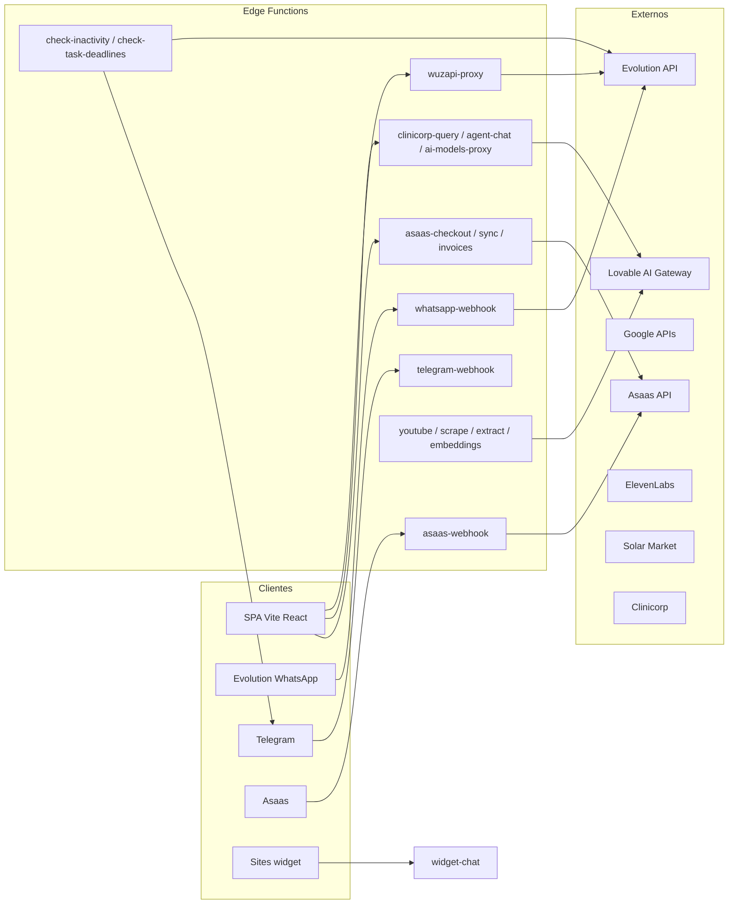

# Engenharia reversa — Edge Functions (Supabase Deno)

**Projeto:** `hapitech-main`  
**Raiz das funções:** `supabase/functions/<nome>/index.ts` (31 funções)  
**Configuração JWT por função:** `supabase/config.toml`  
**Referência de chamadas no frontend:** `src/` (grep `functions.invoke`, `functions/v1/`)

**URL base (produção típica):** `https://<project-ref>.supabase.co/functions/v1/<nome-função>`  
**Método predominante:** `POST` + pré-flight `OPTIONS` (CORS). Exceções indicadas por função.

**Padrão CORS recorrente:** `Access-Control-Allow-Origin: *` na maioria dos ficheiros — qualquer origem pode chamar o endpoint (risco quando combinado com `verify_jwt = false` ou lógica fraca).

---

## 1. Resumo executivo

- **Runtime:** Supabase Edge Functions (Deno), entrada `serve` (`std@0.168.0` / `0.190.0`) ou `Deno.serve`.
- **Autenticação em duas camadas:** (A) gateway Supabase `verify_jwt` (ver `config.toml`); (B) lógica manual com `Authorization: Bearer` + `createClient(...).auth.getUser` / `getClaims` / `auth.admin`.
- **Crítico:** 28 funções têm `verify_jwt = false` no `config.toml`. Três funções **não** aparecem nesse ficheiro (`admin-change-password`, `asaas-invoices`, `verify-recovery-code`) — por omissão no CLI/projeto, o gateway tende a **exigir JWT** (confirmar no Dashboard após deploy).
- **Segredos no código (ambiente antigo / vazamento):** `wuzapi-proxy` e `whatsapp-webhook` contêm **fallback** para URL e chave Evolution em texto plano (`EVO_URL` / `EVO_KEY`). `invite-org-member` e `create-team-user` default `SITE_URL` → `https://bot-mastermind-suite.lovable.app`. `send-recovery-email` default de origem → `https://conversational-iq-suite.lovable.app`.
- **IA:** Gateway Lovable `https://ai.gateway.lovable.dev` (`LOVABLE_API_KEY`), embeddings, chat streaming. `clinicorp-query` e `agent-chat` deduzem créditos e chamam o gateway.
- **Financeiro:** Asaas (`ASAAS_API_KEY`, base prod/sandbox inferida pelo prefixo da chave).
- **WhatsApp:** Evolution API (proxy `wuzapi-proxy`, webhook `whatsapp-webhook`).
- **OAuth Google:** `google-oauth-token`, `google-calendar`, `gmail-oauth-token` (tokens Google + armazenamento em tabelas).
- **Webhooks externos inbound:** `asaas-webhook`, `whatsapp-webhook`, `telegram-webhook` (Telegram também expõe ações `send` / `register` por query string).
- **Risco LGPD / dados:** Uso generalizado de `service_role` no servidor para contornar RLS; logs com `console.log` de emails/códigos/recuperação; `widget-chat` aceita `widgetId` sem JWT no gateway. **`clinicorp-query` confia no `user_id` do body sem validar JWT** — risco máximo de personificação se o endpoint for acessível com anon key.
- **Função aparentemente não usada no `src/`:** `agent-chat` (sem referências; fluxo de chat na UI usa `clinicorp-query` em `AgentChat.tsx`).
- **Inconsistência produto/código:** `Chat.tsx` chama `telegram-webhook?action=send-media`, mas `telegram-webhook/index.ts` **não** implementa `send-media` — apenas `send`, `register` e webhook com `connId` (mídia Telegram provavelmente quebrada ou nunca testada).

---

## 2. Inventário Edge Functions

| # | Pasta | Handler | `verify_jwt` em `config.toml` |
|---|--------|---------|-------------------------------|
| 1 | `accept-invite` | `serve` | `false` |
| 2 | `admin-change-password` | `serve` | *(ausente — default típico `true`)* |
| 3 | `agent-chat` | `serve` | `false` |
| 4 | `ai-models-proxy` | `serve` | `false` |
| 5 | `asaas-checkout` | `Deno.serve` | `false` |
| 6 | `asaas-invoices` | `Deno.serve` | *(ausente)* |
| 7 | `asaas-webhook` | `Deno.serve` | `false` |
| 8 | `calendar-availability` | `serve` | `false` |
| 9 | `calendar-create-event` | `serve` | `false` |
| 10 | `check-inactivity` | `Deno.serve` | `false` |
| 11 | `check-task-deadlines` | `Deno.serve` | `false` |
| 12 | `clinicorp-query` | `serve` | `false` |
| 13 | `create-team-user` | `serve` | `false` |
| 14 | `elevenlabs-conversation-token` | `serve` | `false` |
| 15 | `elevenlabs-tts` | `serve` | `false` |
| 16 | `extract-pdf` | `Deno.serve` | `false` |
| 17 | `generate-embeddings` | `serve` | `false` |
| 18 | `gmail-oauth-token` | `serve` | `false` |
| 19 | `google-calendar` | `serve` | `false` |
| 20 | `google-oauth-token` | `serve` | `false` |
| 21 | `invite-org-member` | `serve` | `false` |
| 22 | `scrape-website` | `Deno.serve` | `false` |
| 23 | `send-recovery-email` | `serve` | `false` |
| 24 | `solarmarket-query` | `serve` | `false` |
| 25 | `sync-subscription` | `Deno.serve` | `false` |
| 26 | `telegram-webhook` | `Deno.serve` | `false` |
| 27 | `verify-recovery-code` | `serve` | *(ausente)* |
| 28 | `widget-chat` | `serve` | `false` |
| 29 | `whatsapp-webhook` | `Deno.serve` | `false` |
| 30 | `wuzapi-proxy` | `Deno.serve` | `false` |
| 31 | `youtube-transcript` | `Deno.serve` | `false` |

**Evidência `verify_jwt`:** `supabase/config.toml` linhas 3–85 (blocos `[functions.<nome>]`).

**`project_id` legado no repo:** `supabase/config.toml` L1 `project_id = "kvhtradegsostrhtzdwn"`.

---

## 3. Fluxo operacional (macro)



- **Automação:** `check-inactivity` e `check-task-deadlines` são adequadas a **cron** (Supabase Scheduler ou externo); **não** há referência no `src/` — invocação esperada por agendamento.
- **Cadeia conhecimento:** upload/conteúdo → `youtube-transcript` / `scrape-website` / `extract-pdf` → `generate-embeddings` (ex.: `youtube-transcript` chama `generate-embeddings` via `fetch` interno).

---

## 4. Dependências críticas

| Dependência | Onde falha se ausente |
|-------------|------------------------|
| `SUPABASE_URL`, `SUPABASE_SERVICE_ROLE_KEY` | Quase todas as funções |
| `SUPABASE_ANON_KEY` | `wuzapi-proxy`, `asaas-checkout`, `asaas-invoices`, `sync-subscription`, `admin-change-password` (cliente com JWT do utilizador) |
| `LOVABLE_API_KEY` | `agent-chat`, `generate-embeddings`, `clinicorp-query`, `widget-chat` (parcial), `telegram-webhook`, `whatsapp-webhook` (IA) |
| `ASAAS_API_KEY` | Checkout, invoices, sync, indiretamente consistência com webhook |
| `GOOGLE_CLIENT_ID` / `GOOGLE_CLIENT_SECRET` | OAuth Google, Gmail, partes de `whatsapp-webhook` (tools) |
| `EVO_URL` / `EVO_KEY` | WhatsApp via Evolution (há fallback **inseguro** em código) |
| `ELEVENLABS_API_KEY` / `ELEVENLABS_AGENT_ID` | Token de conversação voz |
| `SITE_URL` | Redirects de convite/equipa |
| `RECOVERY_WEBHOOK_URL` | Opcional em recuperação de password |

---

## 5. Dependências ocultas

- **URLs em código:** `https://evo-api.meuvendedoronline.com.br` + chave hardcoded (`wuzapi-proxy` ~L40–41; `whatsapp-webhook` ~L8–10).
- **Lovable / domínios antigos:** `*.lovable.app` em `invite-org-member`, `create-team-user`, `send-recovery-email`.
- **Jina Reader:** `scrape-website` usa `https://r.jina.ai/...`.
- **pdf.js via esm:** `extract-pdf` import dinâmico `https://esm.sh/unpdf@0.11.0`.
- **RPC Supabase:** `wuzapi-proxy` → `get_user_org_id`; `ai-models-proxy` → `has_role`; `agent-chat` / `clinicorp-query` → `deduct_credits` (e outras conforme migrações).
- **Chamada interna edge-to-edge:** `youtube-transcript` → `POST .../functions/v1/generate-embeddings` com `Authorization` do utilizador (L254+).
- **Telegram:** `https://api.telegram.org/bot<token>/...` em vários fluxos.
- **Clinicorp / Solar Market:** bases fixas em `clinicorp-query` / `solarmarket-query`.

---

## 6. Problemas segurança

- **`verify_jwt = false`** em massa: qualquer cliente com `apikey` anon pode atingir o endpoint; a segurança repousa **só** na lógica interna (muitas vezes fraca ou inexistente).
- **`generate-embeddings`:** cliente **não** valida JWT no handler — apenas `service_role` e `knowledge_file_id` — **IDOR** se o endpoint for público no gateway.
- **`clinicorp-query`:** não valida `Authorization`; `user_id` vem só do JSON — **personificação / IDOR** com `verify_jwt=false` e `apikey` anon.
- **`widget-chat`:** `service_role` + `widgetId` — superfície pública; depender só do segredo do UUID do widget.
- **`asaas-webhook`:** sem verificação visível de assinatura Asaas no corpo analisado — qualquer POST pode simular eventos (mitigar com token na URL ou validação de assinatura).
- **`telegram-webhook`:** ações `send` e `register` **sem** verificação de sessão utilizador no excerto principal — conhecimento de `botToken` ou parâmetros pode bastar (abuso se URL vazar).
- **`gmail-oauth-token`:** aceita `client_id` / `client_secret` no corpo e grava tokens na **primeira** linha `smtp_settings` — combinação perigosa com `verify_jwt = false`.
- **Fallback `LOVABLE_API_KEY` → `SUPABASE_SERVICE_ROLE_KEY`** em `telegram-webhook` (grep L1031) — uso indevido de segredo supremo como chave de IA.
- **CORS `*`** + logs com PII (emails, códigos).
- **Evolution key** no repositório.

---

## 7. Problemas arquitetura

- Duplicação de lógica de chat IA (`agent-chat` vs `clinicorp-query`).
- Mistura **service_role** + `getUser` no mesmo processo — risco de confundir permissões.
- Webhooks que respondem `200` cedo e processam em background (`waitUntil`) — falhas silenciosas sem retry uniforme.
- `check-inactivity` / `check-task-deadlines` sem autenticação explícita no handler — dependem de segredo de URL / JWT gateway (hoje `false`).

---

## 8. Problemas autenticação

- Confiar em `verify_jwt=false` e depois validar JWT manualmente é **inconsistente** entre funções (`generate-embeddings` omite; `extract-pdf` valida).
- `agent-chat`: ramo **sem** `Authorization` ainda consome créditos do **dono** do agente (comentário explícito ~L435+) — adequado a widget, perigoso se `agentId` enumerável.
- `google-calendar` usa service role para `getUser` — padrão válido se o token for sempre verificado.

---

## 9. Problemas deploy

- Versões mistas `std@0.168.0` vs `0.190.0` entre funções — alinhar para builds reprodutíveis.
- Funções não listadas em `config.toml` podem comportar-se diferente entre `supabase link` e Dashboard.
- `project_id` no `config.toml` pode não coincidir com o novo projeto após migração.

---

## 10. Funções críticas

- `whatsapp-webhook`, `wuzapi-proxy` — mensagens e dados de contactos.
- `asaas-webhook`, `asaas-checkout`, `sync-subscription` — faturação e acesso.
- `clinicorp-query` — dados clínicos/CRM + IA.
- `telegram-webhook` — mensagens, media, IA.
- `admin-change-password`, `invite-org-member`, `create-team-user` — controlo de identidades.
- `gmail-oauth-token`, `send-recovery-email`, `verify-recovery-code` — conta e recuperação.

---

## 11. Funções inseguras ou de alto risco

| Função | Motivo |
|--------|--------|
| `generate-embeddings` | Sem validação de utilizador; service_role; `verify_jwt=false` |
| `clinicorp-query` | Sem JWT no handler; `user_id` do body = personificação se `verify_jwt=false` |
| `asaas-webhook` | Webhook sem assinatura aparente |
| `widget-chat` | Público por design + service_role |
| `gmail-oauth-token` | Escrita global smtp + body com secrets + `verify_jwt=false` |
| `check-inactivity` / `check-task-deadlines` | Sem auth no código + `verify_jwt=false` |
| `telegram-webhook` | Ações auxiliares sem modelo de confiança forte |
| `whatsapp-webhook` | Qualquer corpo JSON para Evolution |

---

## 12. Funções ligadas ao ambiente antigo

- Defaults Lovable / Evolution / `project_id` em `config.toml`.
- Domínios `lovable.app` em convites e recuperação.
- Nome do projeto Supabase legado no TOML.

---

## 13. Plano reconstrução (novo ambiente seguro)

1. Criar projeto Supabase novo; **não** copiar `service_role` antigo para repositório.
2. Definir `verify_jwt = true` por defeito; listar **exceções** justificadas (webhooks puros) e proteger webhooks com **segredo na URL** ou validação de assinatura.
3. Variáveis e secrets apenas via `supabase secrets set` / CI secret store — remover fallbacks de chaves do código.
4. Substituir `Access-Control-Allow-Origin: *` por origens permitidas (env `ALLOWED_ORIGINS`).
5. Implementar rate limit (API gateway à frente ou middleware Deno).
6. Reimplementar `generate-embeddings` com JWT + verificação `user_id`/`knowledge_files`.
7. Corrigir ou remover `telegram-webhook?action=send-media` ou implementar handler.
8. Testes de contrato por função (POST/OPTIONS, 401/403/200).

---

## 14. Plano migração

1. Exportar lista de secrets atuais (painel) e mapear para o novo projeto.
2. Deploy funções em staging com `supabase functions deploy --project-ref <novo>`.
3. Atualizar `VITE_SUPABASE_URL` / keys no frontend.
4. Reconfigurar webhooks externos (Asaas, Evolution, Telegram) para novos URLs.
5. Migração de dados (pg_dump / restore) conforme doc geral Supabase.
6. Cutover DNS/app; monitorizar erros 4xx/5xx nas functions.

---

## 15. Checklist deploy

- [ ] `supabase link --project-ref <ref>`
- [ ] `supabase secrets set KEY=value` para cada ENV listada por função abaixo
- [ ] Ajustar `supabase/config.toml` `project_id` e revisar cada `[functions.*]`
- [ ] `supabase functions deploy <nome>` ou deploy all
- [ ] Configurar cron para `check-inactivity`, `check-task-deadlines` (se usados)
- [ ] Configurar webhooks Asaas / Evolution / Telegram
- [ ] Smoke test com JWT real e com anon key conforme caso

**Comandos úteis:**

```bash
cd c:\workspace_hapitech\hapitech-main
supabase login
supabase link --project-ref <PROJECT_REF>
supabase secrets set SUPABASE_URL=https://xxx.supabase.co SUPABASE_SERVICE_ROLE_KEY=xxx SUPABASE_ANON_KEY=xxx
supabase functions deploy wuzapi-proxy --no-verify-jwt
# Preferir: corrigir código e usar verify_jwt=true no config, depois:
supabase functions deploy wuzapi-proxy
```

---

## 16. Checklist segurança

- [ ] Eliminar chaves Evolution do código; rotacionar chave antiga
- [ ] `verify_jwt=true` exceto webhooks com token secreto dedicado
- [ ] Validar assinatura Asaas (header/documentação Asaas)
- [ ] Restringir CORS
- [ ] Auditar logs (remover email/código em claro)
- [ ] IDOR em `generate-embeddings` corrigido
- [ ] `clinicorp-query`: validar JWT e forçar `user_id === sub` do token (ignorar body)
- [ ] `gmail-oauth-token` exige JWT + utilizador dono das settings
- [ ] Remover fallback `SUPABASE_SERVICE_ROLE_KEY` como `LOVABLE_API_KEY` em `telegram-webhook`
- [ ] Rate limiting em endpoints públicos (`widget-chat`, recuperação)

---

# Secção por função (campos 1–23)

*Convenções:* **Endpoint** = `/functions/v1/<slug>`. **HTTP:** salvo indicação, `OPTIONS` + `POST`. Evidências citadas como `ficheiro:Llinhas`.

---

### `accept-invite`

1. **Nome:** `accept-invite`  
2. **Finalidade:** Concluir convite — definir password, confirmar email, atualizar `profiles`.  
3. **Endpoint:** `/functions/v1/accept-invite`  
4. **Método:** `POST`, `OPTIONS`.  
5. **Fluxo:** JSON `email`, `password`, `name` → validações → `auth.admin.listUsers` → `updateUserById` → opcional `profiles.update`.  
6. **Quem chama:** `src/pages/Auth.tsx` (`supabase.functions.invoke("accept-invite", ...)`).  
7. **Quando:** Fluxo pós-convite na página Auth.  
8. **Dependências:** `@supabase/supabase-js`, `std@0.190.0/http/server`.  
9. **ENV:** `SUPABASE_URL`, `SUPABASE_SERVICE_ROLE_KEY`.  
10. **Secrets:** service role (admin Auth).  
11. **Externas:** nenhuma HTTP além Supabase.  
12. **Supabase:** Auth admin, tabela `profiles`.  
13. **WhatsApp:** não.  
14. **OAuth:** não.  
15. **Financeiro:** não.  
16. **IA:** não.  
17. **Ambiente antigo:** CORS `*`.  
18. **Ocultas:** `listUsers` até 1000/página — escalabilidade.  
19. **Operacional:** falha se Auth admin limitado.  
20. **Segurança:** **sem JWT obrigatório no gateway** (`verify_jwt=false`); qualquer um pode tentar definir password se souber email convidado — **mitigação deve ser token de convite Supabase**, não só email (rever fluxo Auth).  
21. **LGPD:** email em tráfego; logs.  
22. **Se falhar:** utilizador não completa registo.  
23. **Se indisponível:** onboarding bloqueado.

*Evidência:* `supabase/functions/accept-invite/index.ts` L1–95; `config.toml` `[functions.accept-invite]`.

---

### `admin-change-password`

1. **Nome:** `admin-change-password`  
2. **Finalidade:** Owner/admin de organização altera password de outro utilizador na mesma org.  
3. **Endpoint:** `/functions/v1/admin-change-password`  
4. **Método:** `POST`, `OPTIONS`.  
5. **Fluxo:** JWT caller → `getUser` com anon client → verificar `organization_members` role owner/admin → validar alvo na mesma org → `auth.admin.updateUserById`.  
6. **Quem chama:** `src/pages/Teams.tsx` `invoke("admin-change-password")`.  
7. **Quando:** Gestão de equipa.  
8. **Dependências:** supabase-js, std server.  
9. **ENV:** `SUPABASE_URL`, `SUPABASE_SERVICE_ROLE_KEY`, `SUPABASE_ANON_KEY`.  
10. **Secrets:** service role + anon.  
11. **Externas:** nenhuma.  
12. **Supabase:** `organization_members`, Auth admin.  
13–16: não.  
17. **Ambiente antigo:** não explícito.  
18. **Ocultas:** não.  
19. **Operacional:** depende de dados `organization_members` corretos.  
20. **Segurança:** lógica RBAC presente (**boa**); confirmar `verify_jwt` no gateway (ausente no `config.toml`).  
21. **LGPD:** ação sensível; auditar logs L90.  
22. **Falha:** admin não redefine passwords.  
23. **Indisponível:** gestão manual de users.

*Evidência:* `supabase/functions/admin-change-password/index.ts` L9–102.

---

### `agent-chat`

1. **Nome:** `agent-chat`  
2. **Finalidade:** Chat completions streaming via Lovable; créditos; RAG opcional; ramo sem auth para widget.  
3. **Endpoint:** `/functions/v1/agent-chat`  
4. **Método:** `POST` (SSE), `OPTIONS`.  
5. **Fluxo:** parse body → `LOVABLE_API_KEY` → se JWT válido deduz créditos + RAG + `fetch("https://ai.gateway.lovable.dev/v1/chat/completions")` stream; senão ramo “widget” com créditos do dono do agente.  
6. **Quem chama:** **Não encontrado em `src/`** (possível legado ou cliente externo).  
7. **Quando:** desconhecido no repo atual.  
8. **Dependências:** supabase-js, std, gateway Lovable.  
9. **ENV:** `SUPABASE_URL`, `SUPABASE_SERVICE_ROLE_KEY`, `LOVABLE_API_KEY`.  
10. **Secrets:** Lovable + service role.  
11. **Externas:** `https://ai.gateway.lovable.dev/v1/chat/completions`.  
12. **Supabase:** `agents`, `ai_models`, `user_credits`, RPC `deduct_credits`, RAG em tabelas de conhecimento.  
13–15: não.  
16. **IA:** sim (core).  
17. **Ambiente antigo:** gateway Lovable.  
18. **Ocultas:** ramo sem JWT (~L435+).  
19. **Operacional:** rate limit 429 tratado.  
20. **Segurança:** **`verify_jwt=false`** + uso de `agentId` sem auth = **abuso de créditos** se `agentId` previsível.  
21. **LGPD:** conteúdo de mensagens passa pelo gateway.  
22. **Falha:** chat paralelo inoperante.  
23. **Indisponível:** depende se ainda há consumidor.

*Evidência:* `supabase/functions/agent-chat/index.ts` L297–432; `config.toml` L9–11.

---

### `ai-models-proxy`

1. **Nome:** `ai-models-proxy`  
2. **Finalidade:** Gestão de fornecedores/modelos IA (lista, validação de API keys, fetch modelos OpenAI/Groq/etc.) — **apenas `super_admin`**.  
3. **Endpoint:** `/functions/v1/ai-models-proxy`  
4. **Método:** `POST`, `OPTIONS`.  
5. **Fluxo:** JWT → `getUser` → RPC `has_role` super_admin → ações `list_providers`, etc.; fetch a OpenAI, Anthropic, Groq, Mistral conforme ação.  
6. **Quem chama:** `src/hooks/useAiModels.ts` (URL direta com auth).  
7. **Quando:** UI admin de modelos.  
8. **Dependências:** múltiplos `fetch` HTTPS.  
9. **ENV:** `SUPABASE_URL`, `SUPABASE_SERVICE_ROLE_KEY`.  
10. **Secrets:** service role; chaves de fornecedores vindas do corpo/BD.  
11. **Externas:** `api.openai.com`, `api.anthropic.com`, `api.groq.com`, `api.mistral.ai`, etc.  
12. **Supabase:** `ai_providers`, RPC `has_role`.  
16. **IA:** sim.  
20. **Segurança:** `verify_jwt=false` mas gate `has_role` — ainda assim exposição de superfície; preferir JWT gateway.  
*Evidência:* `ai-models-proxy/index.ts` L207–243.

---

### `asaas-checkout`

1. **Finalidade:** Criar customer + subscription/checkout Asaas para plano.  
2. **Endpoint:** `/functions/v1/asaas-checkout`  
3. **Fluxo:** JWT utilizador → validação body `plan_id`, `billing_cycle`, `cpf_cnpj` → Asaas API prod/sandbox.  
4. **Quem chama:** `src/pages/Billing.tsx`.  
5. **ENV:** `ASAAS_API_KEY`, `SUPABASE_*` (anon + service).  
6. **Externas:** `https://api.asaas.com/v3` ou sandbox.  
7. **Financeiro:** sim.  
20. **Segurança:** auth manual presente; `verify_jwt=false`.  
*Evidência:* `asaas-checkout/index.ts` L9–120.

---

### `asaas-invoices`

1. **Finalidade:** Listar faturas/pagamentos Asaas do utilizador.  
2. **Endpoint:** `/functions/v1/asaas-invoices`  
3. **Fluxo:** JWT → `asaas_subscriptions` → `GET /payments?customer=...`.  
4. **Quem chama:** `Billing.tsx`.  
5. **Nota config:** ausente em `[functions]` — verificar JWT no dashboard.  
*Evidência:* `asaas-invoices/index.ts` L29–120.

---

### `asaas-webhook`

1. **Finalidade:** Processar eventos pagamento/subscrição Asaas; atualizar `asaas_subscriptions`, `organizations`, `notifications`.  
2. **Endpoint:** `/functions/v1/asaas-webhook`  
3. **Fluxo:** `req.text()` → parse JSON → filtrar eventos → lookup subscrição → updates.  
4. **Quem chama:** servidores Asaas (configuração painel Asaas).  
5. **Autenticação:** **nenhuma** no código analisado.  
6. **Financeiro:** sim.  
20. **Crítico:** falsificação de webhooks.  
*Evidência:* `asaas-webhook/index.ts` L9–120.

---

### `calendar-availability` / `calendar-create-event`

1. **Finalidade:** Slots livres / criar evento Google Calendar com tokens guardados.  
2. **Endpoints:** `/functions/v1/calendar-availability`, `calendar-create-event`  
3. **Fluxo:** JWT + `connection_id` pertencente a `user.id` → Google Calendar API.  
4. **Quem chama:** `VoiceAgentWidget.tsx` (fetch direto).  
5. **Externas:** `www.googleapis.com/calendar/v3`, `oauth2/v2/userinfo` (no outro ficheiro).  
*Evidência:* `calendar-availability/index.ts` L9–45; `calendar-create-event/index.ts` L9–50.

---

### `check-inactivity`

1. **Finalidade:** Percorrer agentes ativos com `inactivity_rules`; enviar WhatsApp (Evolution), Telegram, webhooks configurados.  
2. **Endpoint:** `/functions/v1/check-inactivity`  
3. **Fluxo:** service role → query `agents` → ações por regra.  
4. **Quem chama:** esperado **cron** (não no `src/`).  
5. **ENV:** `SUPABASE_URL`, `SUPABASE_SERVICE_ROLE_KEY`, `EVO_URL`, `EVO_KEY`.  
6. **Externas:** Evolution `message/sendText/...`, `api.telegram.org`, URLs em `webhook_rules`.  
7. **Autenticação código:** **ausente** — qualquer um pode disparar se gateway público.  
*Evidência:* `check-inactivity/index.ts` L73–90, L17–35.

---

### `check-task-deadlines`

1. **Finalidade:** Notificações `notifications` para tarefas `lead_tasks` a vencer hoje/amanhã.  
2. **Endpoint:** `/functions/v1/check-task-deadlines`  
3. **Fluxo:** service role → query → insert notifications (dedup por metadata).  
4. **Quem chama:** cron esperado.  
5. **Autenticação código:** ausente.  
*Evidência:* `check-task-deadlines/index.ts` L9–80.

---

### `clinicorp-query`

1. **Finalidade:** Chat agent com tools Clinicorp + Solar Market + MCP + embeddings Lovable; dedução de créditos.  
2. **Endpoint:** `/functions/v1/clinicorp-query`  
3. **Fluxo:** body com `user_id`, `agent_id`, `messages`, `mcp_servers` → validações → Clinicorp/SM connections → `https://ai.gateway.lovable.dev` chat/embeddings.  
4. **Quem chama:** `src/components/AgentChat.tsx` (`CHAT_URL` aponta para esta função).  
5. **Segurança (crítico):** o handler **não** lê `Authorization` nem chama `auth.getUser` — confia integralmente no campo JSON `user_id` (`clinicorp-query/index.ts` L531–534). Com `verify_jwt = false` no gateway, um cliente pode enviar **qualquer** `user_id` e consumir créditos/dados dessa conta (**personificação / IDOR grave**). Mitigação: `verify_jwt=true` + derivar `user_id` exclusivamente do JWT no servidor.  
6. **Externas:** `api.clinicorp.com`, `business.solarmarket.com.br`, Lovable, MCP servers URL do cliente.  
*Evidência:* `clinicorp-query/index.ts` L10–13, L518–541, L678+.

---

### `create-team-user`

1. **Finalidade:** Criar utilizador na org (convite/auth admin).  
2. **Quem chama:** `Teams.tsx` fetch direto à function.  
3. **ENV:** `SITE_URL` default `https://bot-mastermind-suite.lovable.app` (~L123).  
*Evidência:* `create-team-user/index.ts` (início do ficheiro + L123 em grep).

---

### `elevenlabs-conversation-token`

1. **Finalidade:** Obter `signed_url` ConvAI ElevenLabs.  
2. **Fluxo:** JWT utilizador → `fetch` ElevenLabs `get-signed-url`.  
3. **ENV:** `ELEVENLABS_API_KEY`, `ELEVENLABS_AGENT_ID`.  
4. **Quem chama:** `VoiceAgentWidget.tsx` invoke.  
*Evidência:* `elevenlabs-conversation-token/index.ts` L9–75.

---

### `elevenlabs-tts`

1. **Finalidade:** `list_voices` / `tts` com chave ElevenLabs do agente (valida `agents.user_id`).  
2. **Quem chama:** `AgentEditor.tsx`, `ElevenLabsSection.tsx`.  
3. **Externas:** `api.elevenlabs.io`.  
*Evidência:* `elevenlabs-tts/index.ts` L9–100.

---

### `extract-pdf`

1. **Finalidade:** Extrair texto de PDF em `knowledge` storage; atualizar `knowledge_files`.  
2. **Auth:** JWT + ownership `knowledge_files.user_id`.  
3. **Dependência oculta:** `esm.sh/unpdf`.  
*Evidência:* `extract-pdf/index.ts` L19–65.

---

### `generate-embeddings`

1. **Finalidade:** Chunking, embeddings via Lovable, escrita `knowledge_chunks`.  
2. **Auth:** **nenhuma** no handler.  
3. **Risco:** **IDOR** + custo API + vazamento de dados entre tenants.  
*Evidência:* `generate-embeddings/index.ts` L54–72, L114–149.

---

### `gmail-oauth-token`

1. **Finalidade:** Trocar `code` Google por tokens; gravar em `smtp_settings`.  
2. **Problema:** aceita `client_id`/`client_secret` no body; primeira linha `smtp_settings`; **sem validação de utilizador** no trecho L20+.  
*Evidência:* `gmail-oauth-token/index.ts` L20–80.

---

### `google-calendar` / `google-oauth-token`

1. **Finalidade:** Calendário (list/save) e troca de code OAuth.  
2. **Auth:** JWT em ambos.  
3. **Externas:** Google Calendar, OAuth token, userinfo.  
*Evidência:* `google-calendar/index.ts` L9–55; `google-oauth-token/index.ts` L48–58.

---

### `invite-org-member`

1. **Finalidade:** Convidar membro para organização (Auth invite + `organization_members`).  
2. **Quem chama:** `Teams.tsx`.  
3. **Default site:** `bot-mastermind-suite.lovable.app` L74.  
*Evidência:* `invite-org-member/index.ts` L9–78.

---

### `scrape-website`

1. **Finalidade:** Scrape URL (Jina + fallback) para conhecimento do agente.  
2. **Auth:** JWT.  
3. **Externa:** `https://r.jina.ai/`.  
*Evidência:* `scrape-website/index.ts` L27–67.

---

### `send-recovery-email`

1. **Finalidade:** Pedido de recuperação — Gmail API ou magic link ou webhook `RECOVERY_WEBHOOK_URL`.  
2. **Auth:** pública (email no body).  
3. **Default origin:** `conversational-iq-suite.lovable.app` L92.  
4. **Logs:** email em claro L83.  
*Evidência:* `send-recovery-email/index.ts` L64–100.

---

### `solarmarket-query`

1. **Finalidade:** Proxy API Solar Market; ação `validate_key` **sem** JWT.  
2. **Quem chama:** `useSolarMarketConnections.ts`, `AgentEditor.tsx`.  
3. **Externa:** `https://business.solarmarket.com.br/api/v2`.  
*Evidência:* `solarmarket-query/index.ts` L94–162.

---

### `sync-subscription`

1. **Finalidade:** Sincronizar estado de pagamento Asaas com BD local.  
2. **Quem chama:** `Billing.tsx`.  
*Evidência:* `sync-subscription/index.ts` L21–100.

---

### `telegram-webhook`

1. **Finalidade:** `action=send`, `action=register`, webhook com `connId`; processamento IA em background.  
2. **ENV:** `LOVABLE_API_KEY`; fallback perigoso para service role (ver grep ficheiro ~L1031).  
3. **Quem chama:** Telegram; `Integrations.tsx`, `useTelegramConnections.ts`, `Chat.tsx` (parcialmente inconsistente para mídia).  
*Evidência:* `telegram-webhook/index.ts` L737–840.

---

### `verify-recovery-code`

1. **Finalidade:** Validar código 6 dígitos `recovery_codes` e definir nova password.  
2. **Auth:** nenhuma; depende de segredo do código.  
3. **Quem chama:** `Auth.tsx`.  
*Evidência:* `verify-recovery-code/index.ts` L10–100.

---

### `widget-chat`

1. **Finalidade:** Resposta IA para widget público via `widget_connections` + agente.  
2. **Auth:** nenhuma; `service_role`.  
3. **ENV:** `LOVABLE_API_KEY` (uso ~L143 em resto do ficheiro).  
*Evidência:* `widget-chat/index.ts` L13–100.

---

### `whatsapp-webhook`

1. **Finalidade:** Receber eventos Evolution (`messages.upsert`, etc.), conversas, mídia, IA, notificações.  
2. **Auth:** nenhuma no handler principal L1190+ (confia na rede Evolution).  
3. **Defaults Evolution:** L8–10.  
*Evidência:* `whatsapp-webhook/index.ts` L1–20, L1190–1230.

---

### `wuzapi-proxy`

1. **Finalidade:** Proxy autenticado para Evolution (múltiplas `action`), RBAC org via RPC `get_user_org_id`.  
2. **Auth:** JWT + `getClaims`; operações sensíveis com service role.  
3. **Fallback EVO:** L39–41.  
4. **Quem chama:** `useWhatsAppConnectionMonitor.ts`, `useChat.ts`, `Chat.tsx`, `AppLayout.tsx`, `useEvolutionApi.ts`.  
*Evidência:* `wuzapi-proxy/index.ts` L9–126.

---

### `youtube-transcript`

1. **Finalidade:** Obter transcrição YouTube, gravar `knowledge_files`, ligar a agente, chamar `generate-embeddings`.  
2. **Auth:** JWT.  
3. **Cadeia:** chama outra edge function — depende de `generate-embeddings` seguro.  
*Evidência:* `youtube-transcript/index.ts` L148–260.

---

## Análise transversal (pedido “ANALISE”)

| Tópico | Achado |
|--------|--------|
| **verify_jwt** | Predominantemente `false` em `config.toml` |
| **service_role** | Uso generalizado em webhooks e funções “admin” |
| **Webhooks** | Asaas, Evolution→whatsapp, Telegram→connId |
| **Callbacks** | OAuth `redirect_uri` frequentemente `postmessage` |
| **Tokens** | Google refresh em BD; Telegram `bot_token` em tabela |
| **OAuth** | Google nas functions listadas |
| **JWT** | Validado manualmente em muitas funções |
| **CORS** | `*` recorrente |
| **Rate limiting** | Delay simples em embeddings; resto pouco |
| **Erros** | try/catch + JSON genérico |
| **Retries** | Poucos explícitos; Telegram/WhatsApp usam `waitUntil` |
| **Logs** | Muitos `console.log` com dados sensíveis |
| **Secrets** | Misturados ENV + body (`gmail-oauth-token`) |

---

## Identificação extra (pedido “IDENTIFIQUE TAMBÉM”)

- **Públicas / baixa barreira:** `asaas-webhook`, `whatsapp-webhook`, `widget-chat`, `send-recovery-email`, `verify-recovery-code`, `solarmarket-query` (`validate_key`), `check-*` sem auth, `generate-embeddings`.  
- **Financeiras:** `asaas-*`, `sync-subscription`.  
- **WhatsApp:** `wuzapi-proxy`, `whatsapp-webhook`, partes de `check-inactivity`.  
- **IA:** `agent-chat`, `clinicorp-query`, `ai-models-proxy`, `widget-chat`, `telegram-webhook`, `whatsapp-webhook`, `generate-embeddings`.  
- **OAuth:** `google-oauth-token`, `google-calendar`, `gmail-oauth-token`.  
- **Administrativas:** `admin-change-password`, `ai-models-proxy`, `invite-org-member`, `create-team-user`.  
- **Não utilizadas no `src/`:** `agent-chat`; cron functions sem referência SPA.  
- **Webhooks “hardcoded”:** construção de URL Asaas/Telegram com `supabaseUrl` do ENV (não domínio antigo fixo, mas acoplado ao project).  
- **URLs antigas:** `lovable.app`, Evolution default, `project_id` no TOML.  
- **Dependência circular:** não estrita; há dependência **em cadeia** youtube → embeddings.

---

## Deploy, configuração, testes, proteção, monitorização, migração, validação (passo a passo)

### 1. Deploy

- Instalar Supabase CLI; `supabase link`; definir secrets; `supabase functions deploy <nome>` ou script CI que faça deploy de todas as pastas em `supabase/functions`.

### 2. Configurar

- Copiar matriz ENV deste documento para o painel **Edge Function Secrets**.  
- Atualizar `config.toml` com `project_id` novo.  
- Para cada webhook externo, registar URL + token.

### 3. Testar

- `curl -i -X OPTIONS` (CORS).  
- `curl -X POST` com `Authorization: Bearer <jwt>` para funções autenticadas.  
- Simular payload Asaas num staging **com** token secreto após endurecimento.  
- Testar Evolution com instância de sandbox.

### 4. Proteger

- Ativar JWT no gateway onde possível.  
- Segredos de webhook na path ou header.  
- Remover fallbacks; CORS restrito.

### 5. Monitorizar

- Logs Supabase Functions + alertas erro rate.  
- Métricas Asaas e Evolution dashboards.

### 6. Recriar

- Novo projeto; deploy funções uma a uma; comparar respostas com ambiente antigo.

### 7. Migrar

- Ver secção 14.

### 8. Validar

- Checklists 15 e 16.  
- Teste E2E: login, billing, WhatsApp mensagem, widget, recuperação password.

---

## Troubleshooting

| Sintoma | Causa provável |
|---------|----------------|
| 401 em função com JWT | Secret anon errado ou token expirado |
| 500 “LOVABLE_API_KEY” | Secret não definido |
| WhatsApp sem resposta | `EVO_URL`/`EVO_KEY` ou instância Evolution |
| Webhook Asaas sem efeito | `asaas_subscription_id` não encontrado na BD |
| Embeddings vazios | `LOVABLE` ou conteúdo ficheiro vazio |
| CORS no browser | Origin não permitida se mudar de `*` para lista |

---

*Documento gerado a partir do código em `c:\workspace_hapitech\hapitech-main`. Para linhas exatas de cada ramo (ficheiros >500 linhas), abrir o `index.ts` correspondente no editor.*
