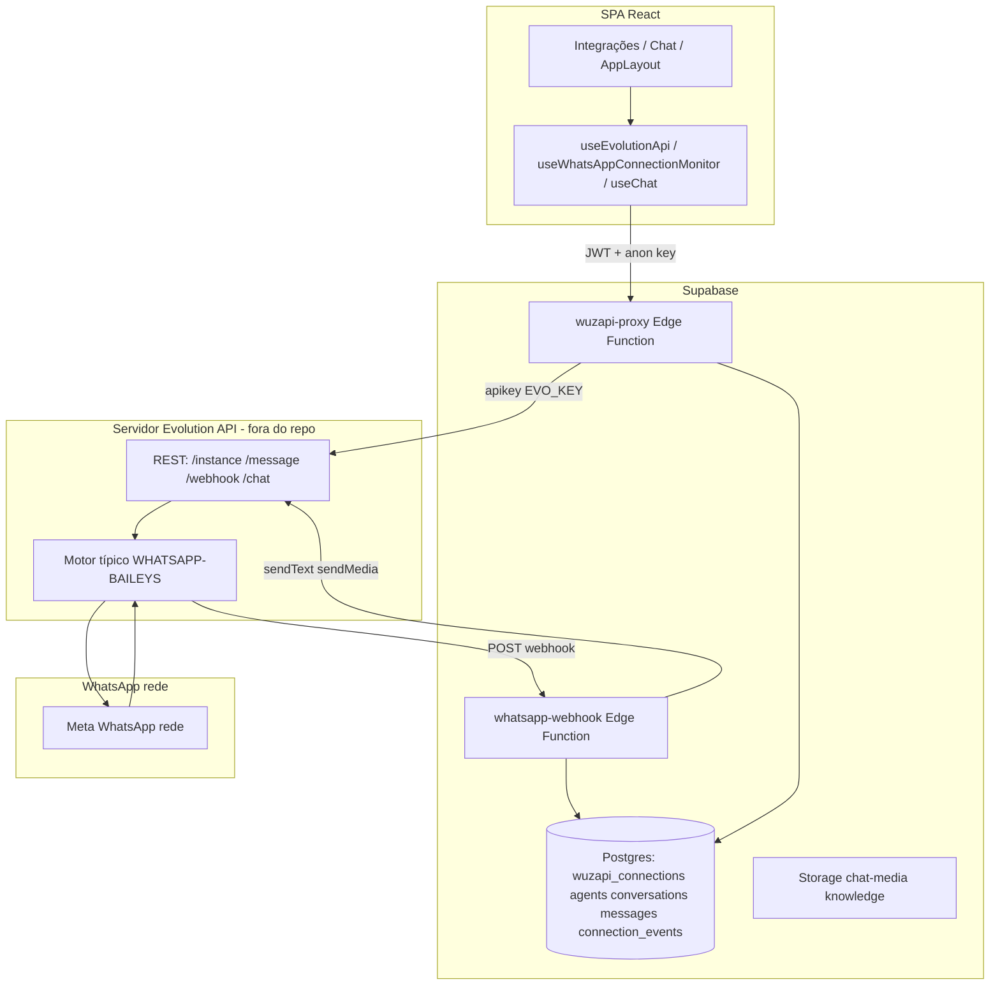

# Engenharia reversa — WhatsApp / Evolution API / “Wuzapi” (projeto hapitech-main)

**Âmbito do repositório:** aplicação web (Vite/React), Supabase (Postgres, Auth, Storage, Edge Functions), e **integração outbound/inbound com um servidor Evolution API** exposto por URL e API key global.  
**Importante — nomenclatura “Wuzapi”:** a migração inicial criou a tabela `wuzapi_connections` com comentário “WuzAPI integration” (`supabase/migrations/20260217144344_16f1855b-854c-44e7-a2b1-85c0f482d0d8.sql` L1–3). O **código operacional atual** não embute um serviço **WuzAPI** (projeto Go separado); a Edge Function chama-se `wuzapi-proxy` mas implementa um **proxy HTTP para a REST API da Evolution API** (`/instance/*`, `/message/*`, `/webhook/*`, `/chat/*`). Ou seja: **Evolution API + Baileys (via tipo de integração)** é o motor real; “Wuzapi” é **legado de naming** na BD e no nome da function.

**Este documento não resume:** cada secção inclui **evidência** (ficheiro + comportamento). Secções finais 1–18 conforme pedido.

---

## 1. Resumo executivo

- **Arquitetura:** Utilizador autenticado na SPA → `supabase.functions.invoke("wuzapi-proxy", …)` com JWT → Edge Function valida claims → chama **Evolution API** com header `apikey: EVO_KEY` → Evolution (instância Baileys) gere sessão WhatsApp, QR, envio/receção. **Receção:** Evolution envia HTTP POST para `https://<SUPABASE_URL>/functions/v1/whatsapp-webhook` (evento `MESSAGES_UPSERT` / variantes) → `whatsapp-webhook` usa `SUPABASE_SERVICE_ROLE_KEY` para gravar conversas/mensagens e responder via Evolution.
- **Persistência de sessão WhatsApp:** **não** está no Postgres desta app além de metadados (`wuzapi_connections`: nome de instância, URL base copiada do env, `is_connected`). O **estado criptográfico da sessão Baileys** fica no **servidor Evolution** (ficheiros/volumes/redis/mongo conforme a **stack que o operador** instalou — **fora deste repo**).
- **Segurança crítica:** `EVO_URL` / `EVO_KEY` têm **fallback hardcoded** em `wuzapi-proxy` e `whatsapp-webhook` (domínio `evo-api.meuvendedoronline.com.br` + chave literal). `whatsapp-webhook` tem `verify_jwt = false` — **endpoint público** na camada Supabase (mitigação deve ser rede + segredo na URL ou validação de origem Evolution, **hoje ausente no código**).
- **Docker no repo:** existe apenas `Dockerfile` para servir o **build estático da SPA** (`node:22-alpine` + `serve`) — **não** orquestra Evolution, Redis, Mongo nem Postgres da Evolution.
- **Meta WhatsApp Cloud API:** **não** há Graph API / WABA no código pesquisado.
- **Coolify / DNS antigo:** **não** aparecem como ficheiros de configuração; documentação interna (`docs/INVENTARIO_SERVICOS_EXTERNOS_COMPLETO.md`, `docs/RECONSTRUCAO_INFRAESTRUTURA_COMPLETA.md`) menciona-os como **implícitos no deploy** do operador.

---

## 2. Arquitetura WhatsApp

### 2.1 Diagrama lógico (evidência no código)



### 2.2 Camadas

| Camada | Tecnologia | Ficheiros-chave |
|--------|------------|-----------------|
| UI | React | `src/pages/Integrations.tsx`, `src/pages/Chat.tsx`, `src/components/AppLayout.tsx` |
| Estado / chamadas | TanStack Query + supabase-js | `src/hooks/useEvolutionApi.ts`, `src/hooks/useWhatsAppConnectionMonitor.ts`, `src/hooks/useChat.ts` |
| Proxy autenticado utilizador | Edge Deno | `supabase/functions/wuzapi-proxy/index.ts` |
| Webhook inbound | Edge Deno | `supabase/functions/whatsapp-webhook/index.ts` |
| Automação inatividade | Edge Deno | `supabase/functions/check-inactivity/index.ts` |
| BD | Postgres + RLS | `supabase/migrations/*wuzapi*`, `20260301215513_create_hapitech_core_schema_v2.sql` L127–137, L166–167 |
| Mídia para envio | Supabase Storage signed URL | `src/lib/media.ts` L23–25, L77–85 |

### 2.3 “Wuzapi” vs Evolution vs Baileys vs Meta

| Conceito | Presente no projeto? | Evidência |
|----------|----------------------|-----------|
| **Evolution API** | Sim (cliente HTTP) | `wuzapi-proxy/index.ts` L165–179, L275–279, L418–451 |
| **Baileys** | Indireto — tipo de integração na criação de instância | `wuzapi-proxy/index.ts` L169–172: `"integration": "WHATSAPP-BAILEYS"`; idem L289 |
| **WuzAPI (serviço Go)** | Não como código embarcado | Tabela legada `wuzapi_connections`; comentário migração `20260217144344_*.sql` |
| **Meta Cloud API** | Não | Sem `graph.facebook.com` / WABA no grep de integração WhatsApp |
| **Instância** | Sim — nome sanitizado guardado em `phone_number` | `wuzapi-proxy/index.ts` L52–55, L58–66; `Integrations.tsx` L497–500 (`instanceName` + hash) |

---

## 3. Fluxo operacional

### 3.1 Criação de “ligação” WhatsApp (UI → BD → Evolution)

1. Utilizador em **Canais / Integrações** escolhe agente e nome base; `handleConnectWhatsApp` gera `instanceName` único com sufixo hex (`Integrations.tsx` L497–509).
2. `saveConfig.mutate` → `invokeEvolution("save-config", { instanceName })` (`useEvolutionApi.ts` L68–71).
3. `wuzapi-proxy` com `action === "save-config"` insere linha em `wuzapi_connections` com `api_token: "managed"`, `instance_url: baseUrl` (URL global do env, não por utilizador), `phone_number: instName` (`wuzapi-proxy/index.ts` L57–67).
4. `onSuccess` chama `create-instance` com `connectionId` (`useEvolutionApi.ts` L76–80).
5. `wuzapi-proxy` faz `POST ${baseUrl}/instance/create` com corpo `instanceName`, `qrcode: true`, `integration: "WHATSAPP-BAILEYS"` (`wuzapi-proxy/index.ts` L166–179).
6. Após criar, tenta registar webhook na Evolution apontando para `${SUPABASE_URL}/functions/v1/whatsapp-webhook` — formato v2 `/webhook/set/:instance` e fallback v1 `/webhook/instance/:instance` (`wuzapi-proxy/index.ts` L218–251).
7. Atualiza `is_connected` se `connectionId` presente (`wuzapi-proxy/index.ts` L259–267).

### 3.2 Fluxo completo das mensagens (inbound)

1. Evolution recebe mensagem na rede WhatsApp (Baileys).
2. Evolution faz POST JSON para URL configurada no webhook.
3. `whatsapp-webhook` `Deno.serve` lê `req.json()`, responde `ok: true` de imediato e agenda `handleWebhook` com `EdgeRuntime.waitUntil` quando disponível (`whatsapp-webhook/index.ts` L1190–1213).
4. Para `messages.upsert` / `MESSAGES_UPSERT`, extrai `instanceName`, `remoteJid`, texto/mídia (`whatsapp-webhook/index.ts` L1230–1291).
5. Ignora grupos `@g.us` (`whatsapp-webhook/index.ts` L1300–1304).
6. Resolve `wuzapi_connections` onde `phone_number` = `instanceName` (`whatsapp-webhook/index.ts` L1307–1321). **Nota:** se múltiplas linhas, usa `connections[0]` — potencial ambiguidade.
7. Grava/atualiza `conversations`, `messages`, pode chamar IA (Lovable/OpenAI conforme resto do ficheiro), e envia resposta com `sendWhatsAppMessage` / `sendWhatsAppAudio` / `sendMedia` (`whatsapp-webhook/index.ts` L1033–1075, L2147–2230).

### 3.3 Fluxo completo das mensagens (outbound — humano na app)

1. `useChat` detecta `remoteJid.endsWith("@s.whatsapp.net")` (`useChat.ts` L253–255).
2. Determina `connectionId` da conversa ou **fallback:** primeira `wuzapi_connections` `is_connected` de qualquer membro da org (`useChat.ts` L256–277).
3. `supabase.functions.invoke("wuzapi-proxy", { action: "send-message", connectionId, body: { number, text } })` (`useChat.ts` L281–292).
4. `wuzapi-proxy` mapeia para `POST ${baseUrl}/message/sendText/${instanceName}` (`wuzapi-proxy/index.ts` L418–421).

### 3.4 Fluxo QR Code

1. Após `save-config`, UI chama `create-instance` (gera QR na resposta Evolution) (`useEvolutionApi.ts` L76–80).
2. Em instância existente, `useEvolutionInstance.fetchQr` chama `action: "connect"` (`useEvolutionApi.ts` L156–164).
3. `wuzapi-proxy` `connect`: `GET /instance/connect/:name`; se 404, auto-create + espera + reconnect (`wuzapi-proxy/index.ts` L274–307).
4. UI extrai `base64` de `data.base64` ou `data.qrcode.base64` ou `data.code` (`useEvolutionApi.ts` L159–163).
5. Polling a cada 5 s com `status` enquanto QR visível (`useEvolutionApi.ts` L226–243).
6. Monitor global a cada **5 minutos** (`useWhatsAppConnectionMonitor.ts` L7, L163–165) compara estado “vivo” vs BD.

### 3.5 Fluxo autenticação (app → Edge → Evolution)

| Passo | Mecanismo | Evidência |
|-------|-----------|-----------|
| SPA → Supabase | JWT utilizador (`Bearer`) | `useEvolutionApi.ts` L24–32 |
| Edge valida utilizador | `createClient` com `SUPABASE_ANON_KEY` + `auth.getClaims(token)` | `wuzapi-proxy/index.ts` L23–36 |
| Edge → Evolution | Header `apikey: <EVO_KEY>` | `wuzapi-proxy/index.ts` L156–158 |
| Webhook Evolution → Edge | **Sem** JWT; corpo JSON livre | `whatsapp-webhook/index.ts` L1190–1200; `config.toml` `[functions.whatsapp-webhook] verify_jwt = false` |

### 3.6 Fluxo sessões

- **Sessão WhatsApp (cripto Baileys):** mantida pelo **processo Evolution**, não serializada na tabela `wuzapi_connections` (apenas `phone_number` = nome instância, `is_connected`, `instance_url`).
- **Sessão browser:** JWT Supabase Auth — irrelevante para Evolution exceto para passar no `wuzapi-proxy`.

### 3.7 Fluxo reconexão

- **Manual:** `connect`, `restart`, `logout`, `delete-instance` (`wuzapi-proxy/index.ts` L274–417).
- **Automática UI:** `useWhatsAppConnectionMonitor` deteta queda, toast “Reconectar”, chama `connect` e evento `wa-qr-ready` (`useWhatsAppConnectionMonitor.ts` L97–124, L41–77).
- **Banner AppLayout:** `invoke("wuzapi-proxy", { action: "connect", connectionId })` e redirect `/canais` (`AppLayout.tsx` L31–44).

### 3.8 Fluxo webhooks

- **Configuração:** feita pela Edge contra Evolution (`/webhook/set/...` ou `/webhook/instance/...`) com `events: ["MESSAGES_UPSERT"]` (`wuzapi-proxy/index.ts` L223–249, L313–325, L371–385).
- **Inbound:** Evolution → `whatsapp-webhook` URL pública Supabase.
- **Outbound regras de negócio:** `agents.webhook_rules` — `fireWebhookRules` POST para URLs configuradas pelo cliente (`whatsapp-webhook/index.ts` L1168–1185; também `check-inactivity/index.ts` L44–62).

### 3.9 Fluxo integrações externas

- **Evolution HTTP:** todas as rotas listadas no `switch (action)` de `wuzapi-proxy/index.ts` L165–489.
- **OpenAI / Lovable:** dentro de `whatsapp-webhook` para transcrição/embeddings/chat (grep `openai.com`, `ai.gateway.lovable.dev` no ficheiro).
- **Google OAuth:** ferramentas auxiliares no mesmo ficheiro grande (ex. `oauth2.googleapis.com/token` ~L566).

### 3.10 Fluxo Supabase

- **RLS / org:** políticas `wuzapi_*` com `_org_user_ids()` (`20260301215513_create_hapitech_core_schema_v2.sql` L772–776).
- **Proxy org:** `get_user_org_id` + membros para autorizar `connectionId` (`wuzapi-proxy/index.ts` L108–126).

### 3.11 Fluxo Edge Functions

- `wuzapi-proxy`: autenticação JWT + proxy REST.
- `whatsapp-webhook`: service role, processamento assíncrono.
- `check-inactivity`: service role + envio texto via Evolution para regras de inatividade (`check-inactivity/index.ts` L167–175, L216–224, L264–272).

### 3.12 Fluxo IA

- Inbound mensagem → agente associado → modelo configurado → resposta → **envio de volta** por `sendWhatsAppMessage` com `EVO_URL`/`EVO_KEY` (`whatsapp-webhook/index.ts` L1640+, L2147+).

### 3.13 Fluxo financeiro

- **Não** há cobrança WhatsApp no código analisado; limites de ligações usam contagens `wuzapi_connections` em `usePlan.ts` L112–117.

### 3.14 Fluxo CRM

- Dados de contacto em `conversations` / `messages` / `leads` (fora do foco deste doc, mas webhook CRM dispara em `webhook_rules`).

---

## 4. Dependências críticas

| Dependência | Onde | Se falhar |
|-------------|------|-----------|
| `EVO_URL`, `EVO_KEY` | Secrets Edge + fallbacks código | Sem QR, sem envio, sem inbound processado corretamente |
| `SUPABASE_URL` | Webhook URL injetada na Evolution | Evolution não consegue notificar |
| `SUPABASE_SERVICE_ROLE_KEY` | `whatsapp-webhook`, partes `wuzapi-proxy` | Webhook não grava BD |
| Evolution servidor UP | Infra externa | Canal WhatsApp inteiro parado |
| `phone_number` = `instanceName` | Resolução webhook | Mensagens ignoradas (“No connection found”) |

**Evidência fallbacks:** `wuzapi-proxy/index.ts` L39–41; `whatsapp-webhook/index.ts` L8–10, L1332–1333.

---

## 5. Dependências ocultas

- **URL Supabase dinâmica** no webhook — ao mudar projeto, **reconfigurar** todas as instâncias Evolution (ou automatizar script).
- **Dois formatos de API webhook** Evolution (v1/v2) — código tenta ambos (`wuzapi-proxy/index.ts` L222–250).
- **Delays fixos** `setTimeout` 1500 ms / 2000 ms / 1000 ms — dependência temporal para race na Evolution (`wuzapi-proxy/index.ts` L221, L295, L312).
- **Signed URLs** Supabase para mídia enviada ao WhatsApp — TTL 1 h (`src/lib/media.ts` L77–85; comentário L78).
- **Evento custom browser** `wa-qr-ready` entre monitor e página Canais (`useWhatsAppConnectionMonitor.ts` L62–63).

---

## 6. Problemas segurança

| ID | Problema | Evidência |
|----|----------|-----------|
| S1 | Chave API Evolution **no repositório** (fallback) | `wuzapi-proxy/index.ts` L40–41; `whatsapp-webhook/index.ts` L9–10 |
| S2 | Webhook **público** (`verify_jwt=false`) sem assinatura HMAC visível | `supabase/config.toml` L12–13; handler L1190+ |
| S3 | Qualquer cliente com `apikey` anon pode chamar `wuzapi-proxy` se `verify_jwt=false` | `config.toml` L3–4 |
| S4 | CORS `*` em ambas functions | `wuzapi-proxy/index.ts` L3–6; `whatsapp-webhook/index.ts` L3–6 |
| S5 | **Takeover de canal:** quem tiver `EVO_KEY` controla todas as instâncias desse servidor | Modelo de confiança global da key |
| S6 | Logs com payloads/instâncias | `wuzapi-proxy/index.ts` L181, L503, L512 |
| S7 | `sendWhatsAppMessage` em `check-inactivity` envia `number: remoteJid` **completo** (pode incluir `@s.whatsapp.net`) — compatibilidade Evolution depende da versão | `check-inactivity/index.ts` L17–20 vs `wuzapi-proxy` que envia só dígitos no chat (`useChat` L288) |

---

## 7. Problemas persistência

- **Estado de sessão Baileys** não está versionado neste repo — backup/disaster recovery da **mensagem** e metadados está no Postgres; **relogin** depende de backup do **servidor Evolution**.
- `wuzapi_connections.instance_url` gravado na criação é o `baseUrl` do env global, não por tenant (`wuzapi-proxy/index.ts` L61–64) — migração de domínio Evolution exige atualização em massa na BD se algum dia for por-tenant.

---

## 8. Problemas containers

- **Não há** `docker-compose.yml` no repo para Evolution/Redis/Mongo — o operador não tem IaC versionada **neste** projeto para o stack WhatsApp.
- `Dockerfile` na raiz é **só frontend** (`Dockerfile` L1–35: `npm run build` + `serve dist`).

---

## 9. Problemas autenticação

- Dois mundos: **JWT utilizador** (`wuzapi-proxy`) vs **nenhum** (`whatsapp-webhook`). A ponte de confiança é “quem conhece a URL pública do Supabase + consegue forjar payload Evolution”.
- `api_token` na BD sempre `"managed"` — não armazena token Evolution por instância (`wuzapi-proxy/index.ts` L64).

---

## 10. Problemas webhooks

- Só subscreve `MESSAGES_UPSERT` — outros eventos (presença, leitura, etc.) **não** estão na lista (`wuzapi-proxy/index.ts` L232, L247).
- Falha silenciosa: `try/catch` em torno de `set webhook` apenas log (`wuzapi-proxy/index.ts` L255–257).

---

## 11. Problemas deploy

- `verify_jwt` desligado para `wuzapi-proxy` e `whatsapp-webhook` (`config.toml` L3–4, L12–13).
- `project_id` legado no TOML (`config.toml` L1) — risco de confusão entre ambientes.

---

## 12. Dependências ambiente antigo

| Item | Evidência |
|------|-----------|
| Domínio Evolution fallback | `https://evo-api.meuvendedoronline.com.br` |
| Chave fallback | literal em `wuzapi-proxy` L41 / `whatsapp-webhook` L10 |
| `project_id` Supabase | `config.toml` L1 |
| Coolify/DNS | apenas mencionado em `docs/*`, não em código |

---

## 13. Plano reconstrução (nova infra segura)

1. **Remover** fallbacks do código; rotacionar chaves antigas.
2. Subir **novo** cluster Evolution (oficial ou imagem suportada), com **volumes** para credenciais Baileys e **backup** off-site.
3. Definir **uma** `EVO_KEY` forte; firewall para só Supabase Edge egress (IPs dinâmicos — frequentemente precisa de **API gateway** ou mTLS em vez de IP fixo).
4. `supabase secrets set EVO_URL=... EVO_KEY=...`
5. Reimplementar webhook com **token secreto** na query (`/whatsapp-webhook?token=...`) validado na Edge, e `verify_jwt` pode permanecer false **mas** com essa validação.
6. Redeploy `wuzapi-proxy` e `whatsapp-webhook`.
7. Para cada linha `wuzapi_connections`, **recriar** instância no novo Evolution ou migrar backup de sessão (operacionalmente complexo — ver secção 14).
8. Atualizar `SUPABASE_URL` nas instâncias Evolution (script ou UI).

---

## 14. Plano migração

| Reutilizar? | O quê |
|-------------|-------|
| **Sim (com revisão)** | Esquema Postgres `wuzapi_connections`, `agents.connection_id`, políticas RLS |
| **Sim** | Código `wuzapi-proxy` após endurecimento |
| **Não reutilizar** | `EVO_KEY` antiga, fallback URL/chave em código |
| **Recriar** | Instâncias Evolution no novo host (nomes podem manter-se se únicos globalmente no novo servidor) |
| **Rotacionar** | Todas as chaves Evolution e URLs webhook |
| **Dependente domínio/DNS antigo** | Qualquer cliente mobile ou firewall que aponte para hostname antigo do Evolution |

**Sessão WhatsApp:** migrar “sem reescanear QR” exige **copiar store** Baileys do volume antigo para o novo — procedimento específico da versão Evolution; **não documentado neste repo**.

---

## 15. Checklist deploy

- [ ] Evolution acessível por HTTPS com certificado válido
- [ ] `EVO_URL` sem barra final consistente (código faz `replace(/\/$/, "")`)
- [ ] `EVO_KEY` igual à configurada no header `apikey` da Evolution
- [ ] `supabase secrets set` para todas as vars
- [ ] `supabase functions deploy wuzapi-proxy whatsapp-webhook check-inactivity`
- [ ] `config.toml` `[functions.*]` alinhado ao ambiente
- [ ] Testar `POST /instance/create` manualmente com curl (fora de produção)
- [ ] Testar webhook com payload de exemplo Evolution
- [ ] Criar ligação pela UI e validar mensagem bidirecional

---

## 16. Checklist segurança

- [ ] Eliminar literais `DEFAULT_EVO_*` do código e commitar
- [ ] Validar webhook (token HMAC, IP allowlist, ou secret path)
- [ ] Reavaliar `verify_jwt` para `wuzapi-proxy` (ideal: `true` + mesmo fluxo)
- [ ] CORS restrito ao domínio da SPA
- [ ] Auditar `console.log` por PII
- [ ] Garantir que `instanceName` não colide entre tenants no mesmo Evolution

---

## 17. Checklist takeover seguro

- [ ] Revogar `EVO_KEY` antiga no painel Evolution
- [ ] Invalidar sessões no painel Evolution (`logout` / `delete-instance` por instância)
- [ ] Limpar `wuzapi_connections` órfãs ou marcar `is_connected=false`
- [ ] Forçar novo QR para cada instância comprometida
- [ ] Verificar `webhook_rules` dos agentes (URLs externas não comprometidas)

---

## 18. Checklist disaster recovery

- [ ] Backup Postgres (conversas, agentes, ligações)
- [ ] Backup volumes Evolution (sessões)
- [ ] Exportar lista `instanceName` ↔ `user_id` da BD
- [ ] Documentar versão exata da imagem Evolution usada
- [ ] Runbook: “Evolution down” → modo degradado (mensagens na app sem envio WA)
- [ ] Teste de restore em staging

---

# Inventário técnico detalhado (pedido “IDENTIFIQUE DETALHADAMENTE”)

## Evolution API — endpoints usados pelo código

| Método | Caminho | `action` / contexto | Ficheiro |
|--------|---------|---------------------|----------|
| POST | `/instance/create` | `create-instance`, auto-create em `connect` | `wuzapi-proxy/index.ts` L166–179, L286–290 |
| GET | `/instance/connect/:instance` | `connect` | L274–279 |
| GET | `/instance/connectionState/:instance` | `status` | L348–350 |
| DELETE | `/instance/logout/:instance` | `logout` | L406–408 |
| DELETE | `/instance/delete/:instance` | `delete-instance` | L410–412 |
| PUT | `/instance/restart/:instance` | `restart` | L414–416 |
| POST | `/message/sendText/:instance` | `send-message`; também `check-inactivity`, `whatsapp-webhook` | L418–421; `check-inactivity/index.ts` L17; `whatsapp-webhook/index.ts` L1041 |
| POST | `/message/sendMedia/:instance` | `send-media` | `wuzapi-proxy/index.ts` L423–437 |
| POST | `/message/sendWhatsAppAudio/:instance` | `send-audio` | L440–450 |
| GET | `/instance/fetchInstances?instanceName=` | `fetch-instances`, `fetch-profile` | L453–459 |
| POST | `/chat/fetchProfilePictureUrl/:instance` | `fetch-contact-picture` | L461–472 |
| POST | `/chat/getBase64FromMediaMessage/:instance` | mídia inbound | `whatsapp-webhook/index.ts` ~L1497 |
| POST | `/webhook/set/:instance` | set webhook v2 | `wuzapi-proxy/index.ts` L223–235, L313–318, L373–378, L477–488 |
| POST | `/webhook/instance/:instance` | set webhook v1 | L240–250, L320–325, L381–385 |

**Autenticação Evolution:** header `apikey: <EVO_KEY>` (`wuzapi-proxy/index.ts` L156–158).

## “Wuzapi”

- **Tabela:** `public.wuzapi_connections` — colunas iniciais `id`, `user_id`, `instance_url`, `api_token`, `is_connected`, `phone_number`, timestamps (`20260217144344_*.sql` L3–14; v2 core L128–136).
- **Unique:** `(user_id, phone_number)` (`20260217153918_*.sql` L6).
- **FK:** `agents.connection_id` → `wuzapi_connections` (`20260301215513_*.sql` L166); `conversations.connection_id` (migração `20260217164939_*.sql` L6).

## Baileys

- Apenas como valor `integration: "WHATSAPP-BAILEYS"` na criação (`wuzapi-proxy/index.ts` L172, L289).

## Meta WhatsApp

- Apenas como rede final; **sem** integração Cloud API no código.

## Instâncias e naming

- Sanitização: NFD, remover acentos, só `[a-zA-Z0-9_-]` (`wuzapi-proxy/index.ts` L53–55, L151–153).
- UI adiciona sufixo aleatório para unicidade (`Integrations.tsx` L498–500).

## QR Code

- Pedido com `qrcode: true` na criação (`wuzapi-proxy/index.ts` L171).
- Leitura no cliente: `useEvolutionApi.ts` L159–163.

## Tokens

- **Supabase JWT:** utilizador para `wuzapi-proxy`.
- **EVO_KEY:** global servidor Evolution.
- **api_token na BD:** constante `"managed"` — não é o token Evolution (`wuzapi-proxy/index.ts` L64).

## Webhooks e callbacks

- Evolution → `whatsapp-webhook` (URL montada com `SUPABASE_URL`) — `wuzapi-proxy/index.ts` L219, L310, L371, L475–476.
- Regras agente → URLs HTTP externas — `whatsapp-webhook/index.ts` L1168–1185.

## Containers / Docker / volumes / restart (neste repo)

- **Não existem** ficheiros que definam containers Evolution, Redis ou Mongo para WhatsApp.
- `Dockerfile` raiz: build SPA (`Dockerfile` L16–17, L34–35).

## Redis / Mongo

- **Sem referência** no código TypeScript/Deno do projeto para Redis/Mongo no fluxo WhatsApp — se a stack Evolution do operador usar, é **externa ao repo**.

## Postgres

- Metadados de ligação, conversas, mensagens, eventos de queda — ver migrations citadas.

## Filas / rate limiting / retries

- **Retries:** `invokeEvolution` até 2 retries com backoff (`useEvolutionApi.ts` L23–44).
- **Rate limiting:** não explícito para Evolution; delay entre chunks embeddings noutro módulo irrelevante aqui.
- **Webhook:** resposta imediata + `waitUntil` (`whatsapp-webhook/index.ts` L1206–1209).

---

# Análise (secção pedida “ANALISE”)

| Tópico | Situação no projeto |
|--------|---------------------|
| Tokens | JWT (SPA) + `EVO_KEY` global + fallback inseguro |
| Autenticação | Forte no `wuzapi-proxy`; ausente no webhook |
| Webhooks | Config v1/v2; evento único MESSAGES_UPSERT |
| Endpoints | Todos derivados de `EVO_URL` |
| Persistência sessão | Fora do repo (Evolution) |
| Containers | Não versionados |
| Docker | Só SPA |
| Volumes | Não definidos no repo |
| Restart | `restart` action exposto |
| Reconnect | `connect` + UI polling |
| Logs | Extensivos |
| Retries | Apenas no hook Evolution |
| Callbacks | `webhook_rules` HTTP POST |
| Filas | `waitUntil` assíncrono, não fila durável |

---

# Riscos segurança (secção dedicada)

- **Takeover:** posse de `EVO_KEY` ou do servidor Evolution.
- **Espionagem:** POST forjado ao `whatsapp-webhook` com payload plausível (se souber `instanceName` e formato).
- **Desconexão:** instância `logout`/`restart` mal chamada.
- **Vazamento mensagens:** logs; BD; Storage signed URLs.
- **QR inseguro:** QR é gerado pela Evolution — qualquer pessoa com acesso ao ecrã ou interceptação do JSON da API vê o base64.
- **Webhook:** superfície pública.
- **Tokens:** fallback em git.
- **Indisponibilidade:** single Evolution URL global.
- **Acesso externo:** CORS `*`.
- **Persistência sessão:** se volume Evolution corrupto, todos os QR de novo.
- **Containers:** imagem Evolution desatualizada/vulnerável — fora do controlo do repo.

---

# Análise operacional

| Cenário | Impacto |
|---------|---------|
| Evolution cai | Sem envio/receção; webhook falha; UI mostra desligado após poll |
| Sessão perdida | `is_connected` false; utilizador deve QR de novo |
| Webhook falha | Mensagens podem chegar ao Evolution mas não à app (inconsistência) |
| Token vazar | Controlo total das instâncias nesse servidor |
| Container Evolution reiniciar | Possível breve downtime; Baileys pode recuperar sessão se volume OK |
| VPS cai | Igual a Evolution down |

---

# Reconstrução completa (passo a passo + comandos)

> **Nota:** os passos 1–7 abaixo são **padrão de mercado** para Evolution API v2; **ajuste** à documentação da versão exata que escolher (imagens oficiais mudam).

### 1–4. Nova Evolution API, containers, Docker, volumes

Exemplo **ilustrativo** (não copiado do repo — o repo **não** traz este ficheiro):

```yaml
# docker-compose.evolution.example.yml — EXEMPLO, não existe no repositório
services:
  evolution:
    image: atendai/evolution-api:v2.2.0 # exemplo: verificar tag atual
    restart: unless-stopped
    ports:
      - "8080:8080"
    environment:
      AUTHENTICATION_API_KEY: ${EVO_KEY}
      SERVER_URL: https://evolution.seudominio.com
    volumes:
      - evolution_store:/evolution/instances
volumes:
  evolution_store:
```

Comandos genéricos:

```bash
docker compose -f docker-compose.evolution.example.yml up -d
docker compose logs -f evolution
```

### 5–7. Persistência, banco, Redis/Mongo/Postgres

- **Postgres/Redis/Mongo da Evolution:** configurados **no** `docker-compose` ou Helm do operador — **não** estão no `hapitech-main`.
- **Postgres Supabase (app):** já contém `wuzapi_connections` etc.

### 8. Gerar novos tokens

```bash
# Exemplo: EVO_KEY forte
openssl rand -hex 32
supabase secrets set EVO_KEY="<valor>" EVO_URL="https://evolution.seudominio.com"
```

### 9. Trocar webhooks

- Após deploy, cada instância deve apontar para `https://<novo-projeto>.supabase.co/functions/v1/whatsapp-webhook` — pode ser feito pela UI que chama `set-webhook` (`wuzapi-proxy` action `set-webhook` L474–489) ou pela própria Evolution UI.

### 10–11. QR Code e sessões

- Usar fluxo SPA existente: Canais → WhatsApp → gera instância → QR (`useEvolutionApi.ts`).
- Se migrar sessão sem QR: restaurar volume `evolution_store` + mesmos `instanceName`.

### 12. Migrar com segurança

- Ver secção 14.

### 13. Validar operação

- Enviar mensagem de teste para número conhecido; verificar linha em `messages`; verificar logs Evolution.

### 14. Monitorizar

- Health HTTP da Evolution (depende da imagem).
- Métricas Supabase Functions (erros 5xx no `whatsapp-webhook`).
- Tabela `connection_events` (inserções em `useWhatsAppConnectionMonitor.ts` L104–110).

### 15. Proteger

- Ver checklists 16–17.

### 16. Backup

- `pg_dump` do projeto Supabase.
- Snapshot de volume Evolution.

### 17. Disaster recovery

- Ver checklist 18.

### Health checks / troubleshooting

| Sintoma | Causa provável | Onde ver |
|---------|----------------|----------|
| QR não aparece | Evolution 404 / key errada | logs `wuzapi-proxy` L181–216 |
| Webhook não dispara | URL Supabase errada na Evolution | `wuzapi-proxy` logs “Webhook set” |
| “No connection found” | `phone_number` ≠ `instanceName` no payload | `whatsapp-webhook` L1314–1316 |
| Mensagem não envia | `connectionId` errado / fallback org | `useChat.ts` L256–277 |
| Mídia falha | signed URL expirou ou Evolution não acede URL | `media.ts` + Evolution outbound |

---

# Ficheiros relacionados à integração WhatsApp (lista de verificação)

| Ficheiro | Papel |
|----------|-------|
| `supabase/functions/wuzapi-proxy/index.ts` | Proxy completo Evolution + webhook setup + CRUD ligação |
| `supabase/functions/whatsapp-webhook/index.ts` | Inbound + IA + envio resposta + mídia |
| `supabase/functions/check-inactivity/index.ts` | Envio WA por inatividade |
| `supabase/config.toml` | `verify_jwt` para `wuzapi-proxy` e `whatsapp-webhook` |
| `src/hooks/useEvolutionApi.ts` | QR, create, delete, perfil, polling |
| `src/hooks/useWhatsAppConnectionMonitor.ts` | Poll 5 min, eventos queda, reconexão |
| `src/hooks/useChat.ts` | Envio texto WA + fallback org |
| `src/pages/Chat.tsx` | `send-media` / `send-audio` via `wuzapi-proxy` |
| `src/pages/Integrations.tsx` | Criação instância + agente `connection_id` |
| `src/components/AppLayout.tsx` | Banner reconexão |
| `src/hooks/usePlan.ts` | Contagem ligações WA |
| `src/lib/media.ts` | URLs assinadas para Evolution |
| `src/components/ContactDetailPanel.tsx` | Query `wuzapi_connections` |
| `supabase/migrations/20260217144344_*.sql` | Criação `wuzapi_connections` |
| `supabase/migrations/20260217153918_*.sql` | Unique user+instance |
| `supabase/migrations/20260301215513_*.sql` | Core schema + RLS |
| `docs/INVENTARIO_SERVICOS_EXTERNOS_COMPLETO.md` | Inventário externo já escrito |
| `docs/RECONSTRUCAO_INFRAESTRUTURA_COMPLETA.md` | Notas reconstrução |
| `Dockerfile` | **Não** Evolution — só SPA |

---

*Fim do documento. Qualquer alteração de código (remover fallbacks, endurecer webhook) deve ser feita em PR separado com rotação de segredos coordenada.*
