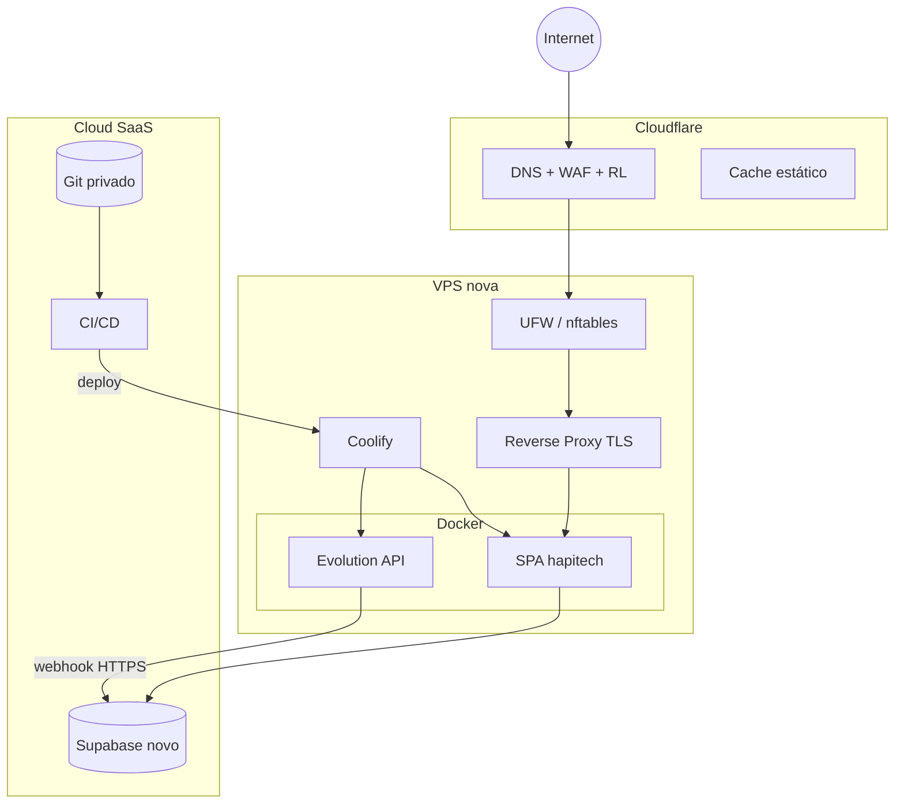

# Plano enterprise — reconstrução total da infraestrutura (hapitech-main)

**Versão:** 1.0  
**Objetivo:** assumir **controlo total** da operação num ambiente **novo**, **seguro**, **escalável**, **auditável**, **resiliente** e **observável**, **eliminando dependências** da infraestrutura, DNS, certificados, projetos Supabase, Evolution, Git e pipelines antigos.  
**Âmbito do código atual (referência):** SPA Vite/React com `VITE_SUPABASE_*` obrigatórios (`src/integrations/supabase/client.ts`); Supabase Edge Functions; Evolution via `wuzapi-proxy` / `whatsapp-webhook`; CI apenas build em `.github/workflows/ci.yml`; empacotamento `Dockerfile` / `nixpacks.toml`; riscos documentados (fallbacks Evolution, `verify_jwt=false` em massa, etc.).

**Princípio:** *zero trust* em hosts, redes e identidades herdados; **recriar** identidades criptográficas e segredos; **migrar** dados com validação formal; **cortar** tráfego só após critérios de saída cumpridos.

---

## 1. Resumo executivo

A reconstrução divide-se em **onze fases** sequenciais com gates de qualidade: (F0) governação e inventário de segredos; (F1) identidade Git e CI/CD; (F2) Cloudflare + DNS; (F3) VPS endurecida; (F4) Docker + Compose base; (F5) Coolify novo; (F6) reverse proxy + TLS; (F7) Supabase novo (projeto, PG, Auth, RLS, Storage, Edge, secrets); (F8) Evolution nova + webhooks; (F9) observabilidade e alertas; (F10) backup e DR; (F11) cutover, burn-in e desativação do legado. Cada fase produz **evidências** (checklist assinado, export de config, testes automatizados) para **auditoria**.

**Dependências do projeto a neutralizar na migração:** `project_id` legado em `supabase/config.toml`; fallbacks `EVO_URL`/`EVO_KEY` e domínios `*.lovable.app` em Edge Functions; webhooks externos (Asaas, Telegram, Evolution) apontando para URLs antigas; `VITE_*` e secrets Supabase em qualquer pipeline ou `.env` antigo.

---

## 2. Arquitetura final recomendada

### 2.1 Camadas

| Camada | Tecnologia recomendada | Função |
|--------|------------------------|--------|
| **Edge DNS/WAF/CDN** | Cloudflare (DNS proxied, WAF, rate limit, TLS opcional “Full strict”) | DDoS, cache estático, ocultar origem, políticas de acesso |
| **Compute** | VPS Linux (KVM) dedicada ou 2× VPS para HA futura | Coolify + Docker Engine |
| **Orquestração** | Docker Compose (gerido pelo Coolify ou ficheiros versionados em Git) | Serviços: Evolution, eventualmente workers; política restart/health |
| **PaaS interno** | Coolify (novo painel, novo URL admin, nova DB interna Coolify) | Deploy Git → build → run; variáveis por ambiente |
| **Backend SaaS** | Supabase **novo** projeto (região explícita, CMK opcional roadmap) | Postgres, Auth, Storage, Realtime, Edge Functions |
| **WhatsApp** | Evolution API **nova** instância (imagem pinada por digest) | Baileys; webhooks só para URL Supabase **novo** |
| **Repositório** | Git **privado** novo (GitHub Enterprise / GitLab self-hosted / Gitea) | Fonte da verdade; branch protection |
| **CI/CD** | GitHub Actions ou GitLab CI com **environments** `development` / `staging` / `production` | Build com secrets; deploy para Coolify via API/webhook **com token rotativo** |
| **Observabilidade** | Uptime (externo) + métricas host (node_exporter / Netdata) + logs (Loki ou similar) + APM front (Sentry) | SLO/alertas |
| **Segredos** | Vault 1Password/HashiCorp ou GitHub Encrypted secrets **por environment** | Sem literais no repositório |

### 2.2 Fluxo de tráfego (produção)

Utilizador → **Cloudflare** (WAF, TLS, cache estático) → **VPS: reverse proxy** (Traefik ou Caddy atrás do Coolify, conforme desenho) → **container SPA** (build com `VITE_*` de produção) → APIs **Supabase** (HTTPS). WhatsApp: Evolution → webhook HTTPS → **Edge Function** `whatsapp-webhook` no projeto novo. Operadores: SSH só com chave + bastion opcional; MFA no Cloudflare e no Git.

---

## 3. Topologia infraestrutura

**Notas topológicas:** (1) Não expor Docker socket à internet. (2) Evolution sem porta pública direta se possível — apenas via Cloudflare Tunnel ou IP allowlist temporária para administração. (3) Separar **rede Docker** `edge` (proxy) de `internal` (DB interna Coolify se aplicável).

---

## 4. Plano reconstrução (fases e entregáveis)

| Fase | Nome | Entregáveis | Gate de saída |
|------|------|--------------|----------------|
| F0 | Governação | RACI, lista de segredos, matriz dados pessoais (LGPD), janela de manutenção | Documento aprovado |
| F1 | Git novo | Repo privado, branch model, proteções, templates PR | Primeiro merge só com 2 revisores |
| F2 | Cloudflare | Zona nova ou subdomínios novos, WAF rules baseline, rate limits | DNS propagado em staging |
| F3 | VPS | SO instalado, hardening, UFW, fail2ban, sem password SSH | Scan CIS nível 1 |
| F4 | Docker | Engine + Compose plugin, logging driver, user namespaces onde suportado | `docker info` saudável |
| F5 | Coolify | Instalação limpa, HTTPS admin, backup interno Coolify | Login MFA operacional |
| F6 | Proxy/TLS | Certificados válidos, HSTS, headers segurança | SSL Labs A mínimo |
| F7 | Supabase | Projeto novo, migrações aplicadas, RLS testado, secrets Edge, `verify_jwt` revisto | Testes integração verdes |
| F8 | Evolution | Instâncias novas, `EVO_KEY` forte, webhooks → novo URL, **código sem fallback legado** | E2E mensagem WA |
| F9 | Observabilidade | Uptime checks, alertas, dashboards | Pager/on-call definido |
| F10 | Backup/DR | RPO/RPO documentados, restore testado em sandbox | DR drill 1× |
| F11 | Cutover | Plano rollback, janela, comunicação | Legado read-only 30d |

---

## 5. Plano segurança (enterprise)

- **Identidade:** MFA em Cloudflare, Git, Supabase dashboard, Coolify admin; RBAC mínimo privilegiado.  
- **Segredos:** inventário completo (incl. `LOVABLE_API_KEY`, `ASAAS_API_KEY`, Google, Evolution, anon/service_role); **rotação** na viragem; **nunca** reutilizar `SUPABASE_SERVICE_ROLE_KEY` antiga.  
- **Código:** remover literais `DEFAULT_EVO_*` e defaults `lovable.app` antes do primeiro deploy em produção nova (`wuzapi-proxy`, `whatsapp-webhook`, convites, recovery).  
- **Supabase:** rever **cada** `[functions.*] verify_jwt` em `config.toml`; webhook Evolution com **token secreto** na query validado na Edge.  
- **Rede:** só portas 80/443 (e 22 de IP administrador) na VPS; Evolution admin atrás de VPN ou tunnel.  
- **Auditoria:** Git audit log; Supabase logs; Cloudflare logs; retenção alinhada à política legal.

---

## 6. Plano DevOps

- **Branches:** `main` protegida; `develop` → deploy automático **staging**; `main` ou tag `v*` → deploy **production** com aprovação.  
- **Build:** `npm ci`; injetar `VITE_SUPABASE_URL` e `VITE_SUPABASE_PUBLISHABLE_KEY` via secrets CI; alinhar `Dockerfile` com `ARG`/`ENV` para build reprodutível.  
- **Artefactos:** imagem Docker com tags **imutáveis** (`sha`, `semver`); SBOM (Syft) anexado ao release.  
- **Supabase:** pipeline opcional `supabase db push` / `functions deploy` com token de automação **scoped** e ambiente isolado.  
- **Coolify:** um **Application** por ambiente (staging/prod) ou labels claros; webhooks de deploy com segredo rotativo.

---

## 7. Plano observabilidade

- **Logs:** agregação (Vector/Fluent Bit → Loki ou cloud); retenção 30–90d; **mascaramento** PII em logs de aplicação.  
- **Métricas:** CPU/mem/disco VPS; métricas HTTP 5xx no proxy; Supabase dashboard quotas.  
- **Uptime:** checks externos multi-região sobre `/` e health dedicado.  
- **APM:** Sentry (ou OpenTelemetry) no front para erros JS e performance.  
- **Alertas:** SLO exemplo — disponibilidade 99.5% mensal; latência p95 API; fila de falhas webhook Asaas.

---

## 8. Plano backup

- **Supabase:** backups automáticos do plano + export `pg_dump` cifrado para object storage imutável (WORM opcional).  
- **Storage:** buckets `knowledge`, `chat-media` — política de lifecycle + replicação.  
- **Evolution:** volumes de instâncias — snapshot diário + teste de restore.  
- **Coolify:** backup da base interna do Coolify e ficheiros de compose gerados.  
- **Cloudflare:** export periodicamente config DNS/WAF (Infrastructure as Code ou API dump).  
- **Git:** redundância (mirror secundário).

---

## 9. Plano disaster recovery (DR)

- **RTO/RPO:** definir por componente (ex.: RPO BD 1h, RTO app 4h).  
- **Cenários:** perda VPS; compromise Supabase; perda região Cloudflare (failover DNS secundário); Evolution corrompido.  
- **Procedimento:** runbook com contactos, ordem de restore (DNS → TLS → Supabase → Edge secrets → Evolution → app), **drill semestral**.  
- **Comunicação:** status page interna/externa.

---

## 10. Plano escalabilidade

- **Curto prazo:** vertical na VPS (vCPU/RAM), separar Evolution para **segunda** VPS se CPU WhatsApp competir com SPA.  
- **Médio prazo:** CDN para `dist/` (Cloudflare Pages ou R2 + Workers) reduz carga no origin.  
- **Longo prazo:** HA proxy (2× VPS + keepalived ou LB gerido); Supabase **scale** conforme oferta; read replicas se aplicável.  
- **Multiambiente:** isolamento total de secrets e dados entre dev/staging/prod.

---

## 11. Plano CI/CD

- **CI:** lint, testes **bloqueantes** em `main`, `npm audit` com política, build com `VITE_*` de staging em PR.  
- **CD:** build imagem → scan Trivy → push registry → deploy Coolify via API → smoke `curl` + teste login.  
- **Promotion:** artefacto staging promovido a prod (mesmo digest) para consistência.  
- **Documentação:** ADR para mudanças de infra.

---

## 12. Plano rollback

- **App:** redeploy digest anterior no Coolify; manter **N** versões no registry.  
- **Supabase:** migrações reversíveis; em falha grave restore backup PITR para **novo** branch de BD ou projeto sandbox antes de promover.  
- **DNS:** TTL baixo na semana de cutover; rollback = revert CNAME para origin antigo **só** se plano de contingência exigir (objetivo é não depender do legado).  
- **Evolution:** manter instância antiga read-only até validação; rollback WA = repoint webhook (último recurso).

---

## 13. Plano migração e cutover

### 13.1 Sair da infra antiga

1. **Congelar** alterações no legado (read-only Git opcional).  
2. **Clonar** dados Supabase (schema + dados) para projeto novo com ferramentas oficiais; **não** copiar `service_role` para repositório.  
3. **Reimplementar** secrets no novo projeto; **rotacionar** todas as chaves externas (Asaas, Google OAuth, Evolution, Lovable).  
4. **Atualizar** código removendo fallbacks e fixando `verify_jwt` onde aplicável.  
5. **Staged rollout:** staging completo → UAT → produção com canário (1% tráfego Cloudflare ou subdomínio beta).

### 13.2 Cutover com downtime mínimo

- Pré-aquecer caches e SSL.  
- Reduzir TTL DNS dias antes.  
- Cutover em janela: atualizar CNAME `app` → novo origin; validar imediatamente smoke; manter legado **up** em paralelo **48–72h**.  
- Pós-cutover: monitorização reforçada 7 dias.

### 13.3 Validações obrigatórias

| Domínio | Validação |
|---------|-----------|
| DNS | `dig` + propagation checkers; apenas IPs/endpoints novos |
| SSL | SSL Labs, `curl -vI https://...`, certificado correto e cadeia |
| Deploy | health HTTP 200, versão build visível (hash em `/meta` opcional) |
| Webhooks Asaas | evento teste sandbox/prod conforme ambiente |
| Webhooks Evolution/Telegram | mensagem teste end-to-end grava em `messages` |
| WhatsApp | QR novo número ou migração de sessão validada; envio+receção+IA smoke |

---

## 14. Checklist infraestrutura

- [ ] VPS provisionada com disco SSD/NVMe adequado  
- [ ] Cloudflare zona ativa, SSL mode Full (strict)  
- [ ] Docker + Compose instalados e afinados  
- [ ] Coolify instalado com URL admin e MFA  
- [ ] Reverse proxy com TLS e IPv6 se necessário  
- [ ] Supabase projeto criado na região desejada  
- [ ] Evolution com volume persistente e backup  
- [ ] Git privado e espelho  
- [ ] CI/CD com environments e secrets

---

## 15. Checklist segurança

- [ ] SSH só chave, `PermitRootLogin no`, `PasswordAuthentication no`  
- [ ] UFW/nftables: deny incoming default  
- [ ] fail2ban ou equivalente Cloudflare + sshguard  
- [ ] MFA em todas as consolas administrativas  
- [ ] Segredos fora do Git; scan de repo limpo  
- [ ] WAF Cloudflare: OWASP Core Ruleset, rate limit login  
- [ ] Headers segurança (HSTS, X-Frame-Options, CSP progressiva)  
- [ ] Auditoria trimestral de IAM

---

## 16. Checklist deploy

- [ ] `VITE_*` corretos no build de cada ambiente  
- [ ] Imagem/tag imutável registada  
- [ ] Edge Functions deployadas com `supabase secrets set` completo  
- [ ] Migrações `db push` ou pipeline equivalente  
- [ ] Webhooks externos atualizados para URLs finais HTTPS  
- [ ] Smoke automatizado pós-deploy

---

## 17. Checklist produção

- [ ] SLO definido e monitorizado  
- [ ] On-call e escalação documentados  
- [ ] Quotas Supabase monitorizadas  
- [ ] Plano de capacidade Evolution (RAM/CPU)  
- [ ] Política de retenção de logs e dados  
- [ ] Contacto jurídico/DPO para incidentes dados

---

## 18. Checklist cutover

- [ ] Comunicação a stakeholders (data/hora)  
- [ ] Rollback documentado em 1 página  
- [ ] TTL DNS pré-reduzido  
- [ ] Equipa em guerra durante janela  
- [ ] Validação pós-cutover em checklist §13.3  
- [ ] Legado mantido read-only até data acordada

---

## 19. Checklist auditoria

- [ ] Export config Cloudflare datado  
- [ ] Export políticas RLS / schema Supabase  
- [ ] Lista imagens Docker com digest deployados  
- [ ] Log de aprovações deploy (Git + Coolify)  
- [ ] Evidência testes DR  
- [ ] Revisão anual de fornecedores (DPA, sub-processadores)

---

# Ambientes: development, staging, production

### Development

- **Git:** branches feature; PR para `develop`.  
- **Supabase:** projeto **dev** separado (dados sintéticos) ou branch de base de dados se usar branching (oferta Supabase).  
- **URLs:** `dev.app.dominio.com` atrás de Cloudflare; sem cache agressivo.  
- **Secrets:** valores não produtivos; rotação independente.

### Staging

- **Paridade:** o mais próximo possível de produção (mesmo Compose, menos réplicas).  
- **Dados:** anonimizados ou subset; **nunca** cópia completa de PII prod sem consentimento.  
- **Deploy:** automático a cada merge em `develop`.  
- **Integrações:** Asaas sandbox; Evolution instância `staging-*`; Google OAuth projeto console “staging”.

### Production

- **Deploy:** manual aprovado ou tag `v*`.  
- **MFA** obrigatório; **quatro olhos** em alterações WAF/DNS críticas.  
- **Read-only** default para operadores; elevação temporária auditada.

---

# Anexo A — Detalhamento operacional (itens 1–87)

## Infraestrutura (1–7)

**1. Criar nova VPS:** escolher região próxima aos utilizadores e ao Supabase escolhido; criar VM com Ubuntu LTS ou Debian stable; hostname FQDN; discos separados `/` e `/var/lib/docker` se possível; ativar backups de snapshot no provedor.

**2. Escolher provedor:** critérios — SLA, compliance (ISO 27001), egress generoso, IPv4 estático, suporte snapshot, reputação DDoS; comparar Hetzner, OVH, Latitude, AWS Lightsail (custo vs controlo).

**3. Dimensionar servidor:** baseline para stack Coolify + Evolution + proxy: **4 vCPU / 8 GB RAM / 100 GB SSD** mínimo recomendado para carga pequena-média; Evolution e build CI competem por CPU — monitorizar e escalar; disco para imagens Docker e logs locais.

**4. Organizar ambientes:** três namespaces lógicos (dev/staging/prod) com **isolamento** de secrets e DNS; opcionalmente três VPS menores vs uma VPS grande com segmentação rigorosa (preferir isolamento físico para produção crítica).

**5. Organizar redes:** VPC/provider security groups; na VPS UFW; em Docker redes `edge` vs `internal`; não publicar portas internas Coolify.

**6. Organizar volumes:** nomeados por função (`caddy_data`, `evolution_store`, `coolify_db`); labels backup; evitar bind mounts de pastas home para dados sensíveis sem cifra.

**7. Persistência:** dados de aplicação em Supabase; sessões WA em Evolution volume; certificados ACME em volume proxy; política de IOPS.

## Linux (8–16)

**8. Configuração Linux:** timezone NTP; `unattended-upgrades` ou equivalente; `journald` persistente limitado; `sshd` hardened.

**9. Hardening:** CIS benchmark ou scripts community moderados; desativar serviços não usados; AppArmor/SELinux conforme compatibilidade Coolify.

**10. Atualizações:** janela mensal patch; kernel livepatch se disponível; reboot orchestrado.

**11. Utilizadores:** utilizador `deploy` sem sudo completo; sudoers com comandos específicos se necessário.

**12. Permissões:** `umask` restritivo; ACLs mínimas em diretórios de dados.

**13. SSH Keys:** só Ed25519; rotação anual; princípio uma chave por operador/dispositivo.

**14. Fail2Ban:** jails `sshd` + opcional `nginx`/`traefik`; whitelist IPs escritório/VPN.

**15. UFW:** default deny; allow 80,443 from anywhere; 22 from escritório IP ou VPN só.

**16. Segurança SSH:** desativar password; `AllowUsers`; `MaxAuthTries` baixo; opcional `AllowTcpForwarding no` se não precisar.

## Docker (17–24)

**17. Instalação Docker:** oficial `get.docker.com`; pin de versão major em documentação; grupo `docker` só para utilizadores confiáveis.

**18. Docker Compose:** plugin v2; ficheiros versionados em `infra/`; `docker compose config` no CI para validar YAML.

**19. Networks:** bridge custom; não usar `host` network para serviços expostos.

**20. Volumes:** driver local ou volume plugin cifrado se requisito compliance.

**21. Persistência:** backup de volumes Evolution e Coolify; documentar caminhos.

**22. Healthchecks:** `curl`/`wget` ou `node -e fetch` em SPA; HTTP interno para Evolution health endpoint conforme imagem.

**23. Restart policies:** `unless-stopped` para serviços stateful; `on-failure:5` com backoff onde fizer sentido.

**24. Segurança containers:** utilizador não-root nas imagens custom; `read_only` rootfs onde possível; `no-new-privileges`; limitar `cap_drop: ALL` quando compatível.

## Coolify (25–31)

**25. Instalação Coolify:** seguir documentação oficial numa VPS limpa; URL admin aleatória forte ou protegida por Cloudflare Access.

**26. Configuração:** integração Git; registry credentials; notificações deploy falhados.

**27. Organização projetos:** um projeto “Hapitech” com serviços `web-staging`, `web-prod`, `evolution-prod`.

**28. Ambientes:** variáveis por serviço; não misturar `VITE_*` prod em staging.

**29. Deploy automático:** webhook de Git com segredo; apenas branch autorizada.

**30. Variáveis ENV:** espelhar matriz `docs/AUDITORIA_VARIAVEIS_SEGREDOS_COMPLETA.md`; nunca `SERVICE_ROLE` no front.

**31. Segurança Coolify:** MFA; backups da DB interna; limitar IPs admin.

## Proxy / SSL (32–37)

**32. Reverse proxy:** Traefik (integração labels) ou Caddy (simplicidade); terminação TLS no edge.

**33. Nginx/Traefik:** escolha única por ambiente; config versionada em Git.

**34–37. SSL/HTTPS/certificados/renovação:** ACME HTTP-01 ou DNS-01 (preferível atrás Cloudflare com API token scoped); renovação automática; monitorar expiração; OCSP stapling.

## Cloudflare / DNS (38–44)

**38–39. Cloudflare + DNS:** zona importada ou NS delegados; registos `A`/`AAAA` ou CNAME para origin; subdomínios `api` só se necessário (Supabase tem URL própria).

**40. DDoS:** planos com mitigação; under attack mode playbook.

**41. Proxy Cloudflare:** orange cloud para SPA; gray cloud apenas se TLS origin específico exigir (documentar).

**42. Cache:** cache agressivo só para assets estáticos com hash; bypass cache em rotas dinâmicas se existirem.

**43. WAF:** managed rules + custom rules para path admin.

**44. Rate limiting:** login, recuperação password, endpoints sensíveis.

## Supabase (45–51)

**45. Novo projeto:** região e plano definidos; organização GitHub/GitLab ligada.

**46. Banco:** aplicar migrações do repositório `supabase/migrations`; validar extensões (`vector`, etc.).

**47. Auth:** SMTP próprio; URLs redirect corretas; MFA para utilizadores admin se disponível.

**48. RLS:** revisão completa; testes de penetração em tabelas sensíveis.

**49. Storage:** buckets e políticas; CORS restrito ao novo domínio.

**50. Edge Functions:** `supabase functions deploy`; `secrets set`; revisar `verify_jwt` por função.

**51. Segurança Supabase:** service_role só em backend seguro; leak scan; desativar endpoints não usados.

## Evolution API (52–57)

**52. Nova instância:** imagem pinada; rede interna; `EVO_KEY` forte.

**53–54. Persistência e volumes:** volume dedicado; backup incluído no plano DR.

**55. Webhooks:** URL `https://<novo-projeto>.supabase.co/functions/v1/whatsapp-webhook` + **token secreto** validado na function após endurecimento de código.

**56. Tokens:** sem literais no Git; rotação se repositório antigo foi público.

**57. Segurança WhatsApp:** limitar quem pode chamar API Evolution; monitorizar envios; política de conteúdo.

## Git / CI-CD (58–64)

**58. Git privado:** migrar histórico ou import limpo; remover remotes antigos.

**59. Branches:** GitFlow simplificado ou trunk-based com feature flags.

**60–62. CI/CD / Actions / deploy auto:** workflows separados CI vs CD; secrets por environment.

**63. Rollback:** tags e digest.

**64. Versionamento:** semver releases; changelog.

## Observabilidade (65–70)

**65–66. Logs e monitorização:** ver secção 7.

**67. Uptime:** multi-ponto.

**68. Métricas:** RED/USE para serviços críticos.

**69. Alertas:** PagerDuty/Opsgenie ou email operação.

**70. Auditoria:** trilhas imutáveis (WORM ou SIEM).

## Backup / Recovery (71–76)

**71–75.** Ver secções 8–9; incluir **backup de configs** (export Coolify, DNS, compose) e **sessões** Evolution.

**76. Plano recuperação:** ordem documentada e testada.

## Segurança gestão (77–83)

**77–80.** Vault, rotação, gestão acessos, RBAC — integrar com identidade corporativa se existir.

**81. RBAC:** Supabase roles; Git teams; Cloudflare roles.

**82. MFA:** obrigatório admins.

**83. Auditoria acessos:** revisões trimestrais de quem tem keys.

## Escalabilidade (84–87)

**84–87.** Ver secção 10; adicionar **sharding** futuro por organização se multi-tenant crescer; **read replicas** conforme oferta Supabase; **queue** para jobs pesados se surgirem.

---

# Estratégias consolidadas (secção GERAR)

| Estratégia | Resumo |
|------------|--------|
| **Arquitetura final** | Secção 2 + diagrama §3 |
| **Topologia** | §3 |
| **DevOps** | §6 + §11 |
| **Segurança** | §5 + §15 + Anexo A 77–83 |
| **Backup** | §8 + §17 |
| **Observabilidade** | §7 + §19 |
| **Escalabilidade** | §10 |
| **Rollback** | §12 |
| **Disaster recovery** | §9 |

---

**Fim do plano.** Este documento deve ser tratado como **living document**: atualizar após cada DR drill, mudança de fornecedor ou auditoria. Para alinhamento com o código atual do repositório, cruzar com `docs/ENGENHARIA_REVERSA_*`, `docs/AUDITORIA_*` e `docs/INVENTARIO_*`.
